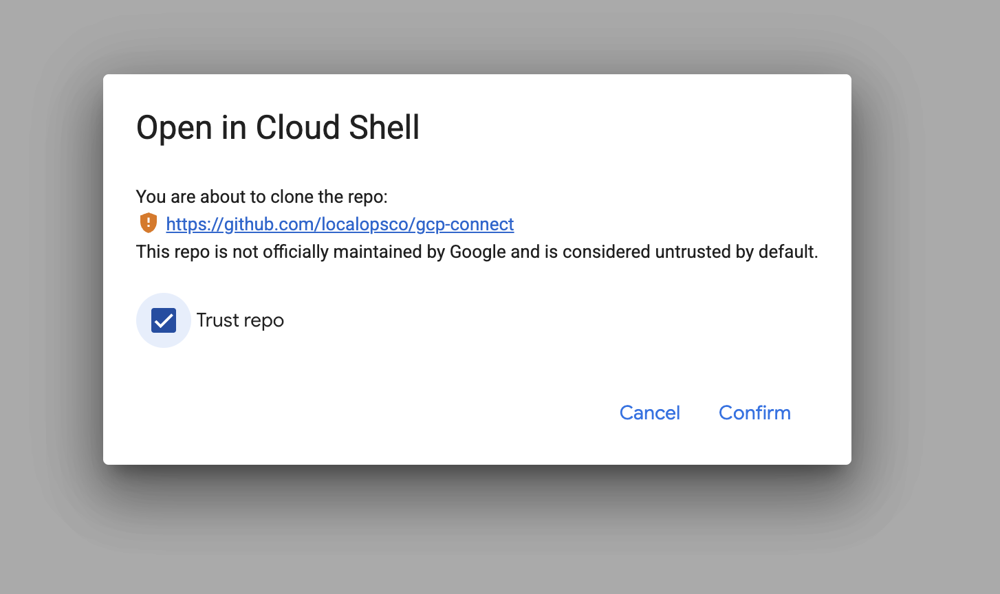
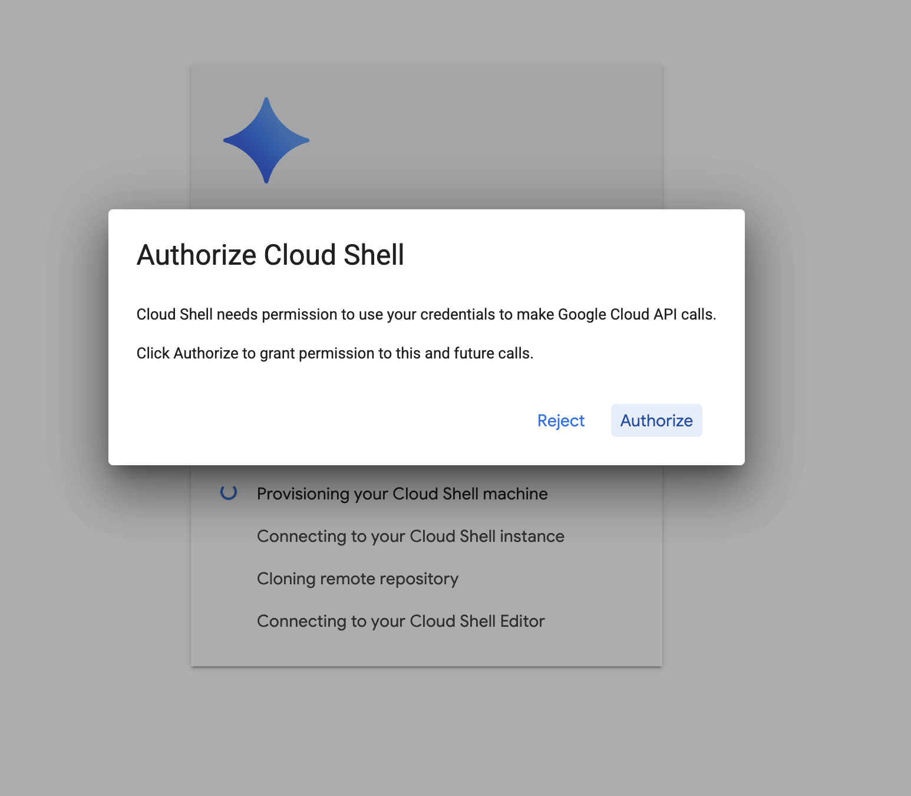

To connect your **Google Cloud Platform (GCP)** account with your LocalOps account, you must create a Connection in
LocalOps.

## Connections

A connection represents LocalOps's access to the target cloud account. All operations performed by LocalOps on a target
cloud account, are done through its corresponding connection.

## Pre-requisites

1. A Google Cloud account.
2. A new Google Cloud project to connect. We recommend creating a brand new project for LocalOps to keep it isolated
   from your other resources.
3. You'll need `Owner` access to the target Google Cloud project. If you are connecting your client/customer's Google
   Cloud project, the point of contact in your customer's end must have `Owner` access to the project.

## Create a new connection

<Steps>
  <Step title="Add a new connection">
    Sign in to LocalOps, click on **"Connections"** from the navigation pane on the left side and click on
    **"Add a new connection"**.
  </Step>
  <Step title="Pick Google Cloud">
    Pick **Google Cloud** as the cloud provider, give the connection a name and click **"Connect GCP account"**.
  </Step>
  <Step title="A new Cloud Shell window opens">
    A new Google Cloud Shell window opens in a separate browser tab. When you open the Cloud Shell tab for the first
    time, a few popups will show up. **Just authorize and accept all the popups** to continue to Cloud Shell.

    <Frame caption="Trust the repo and click Confirm">
      
    </Frame>

    <Frame caption="Click Authorize to let Cloud Shell make Google Cloud API calls">
      
    </Frame>
  </Step>
  <Step title="Run the setup command">
    Go back to the previous LocalOps tab and follow the instructions shown to copy and paste the setup command into the
    Cloud Shell.

    Here is a sample of the setup command you will see in the LocalOps console. The values shown below are placeholders —
    use the exact command displayed in your LocalOps console, as it contains the credentials specific to your connection.

    ```bash
    export OPS_API_URL="https://console.localops.co" \
           OPS_CONNECTION_ID="xxxxxxxxxxxxxxxxxxxxx" \
           OPS_VERIFICATION_TOKEN="xxxxxxxxxxxxxxxxxxxxxxxxxxxxxxxxxxxxxxxx" && \
    ./setup.sh
    ```
  </Step>
  <Step title="Pick a Google Cloud project">
    When the command asks you to pick a Google Cloud project to connect, pick one and proceed.
  </Step>
  <Step title="Terraform provisions access">
    The command runs a Terraform script that creates a new service account with the `Owner` role. This is the service
    account LocalOps uses to access the project and manage resources henceforth.
  </Step>
</Steps>

Once the setup command completes, come back to the LocalOps Connections page to see the connection becoming Active.

<Note>
  When you open the Cloud Shell tab for the first time, a few popups will appear (trust the repo, authorize Cloud
  Shell). Just authorize and accept all of them to continue.
</Note>

## How does this access work?

To connect to the target Google Cloud project, the setup command runs a Terraform script inside Google Cloud Shell that
creates a new service account with the `Owner` role. LocalOps uses this service account to access the project and manage
resources on your behalf whenever you trigger an operation (say a new deployment) from the LocalOps console.

The Terraform script that runs in your Cloud Shell to set up the connection is open source and available here:
[github.com/localopsco/gcp-connect](https://github.com/localopsco/gcp-connect/).

## Safe and secure

Your connection works through a _keyless OIDC protocol_. LocalOps does not store or keep any permanent credentials at
its end to access your Google Cloud project.

Instead of long-lived keys, access is authenticated on demand through OIDC. Whenever LocalOps needs to access your
project, it obtains short-lived credentials just for that operation — there are no static keys sitting around that could
be leaked or misused. This makes the connection safe and secure by design.

## Need help?

If you have any questions during this process, chat with us from the chat bar on the bottom-right side, or write to us
at support@localops.co.
