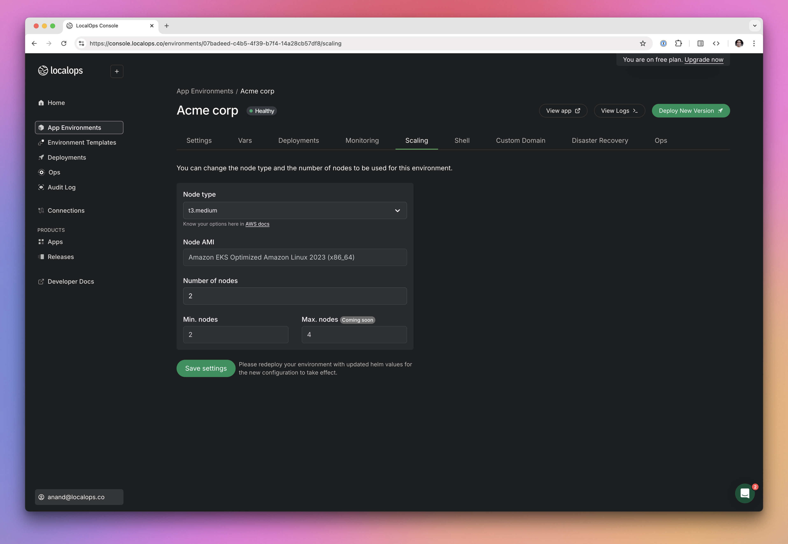
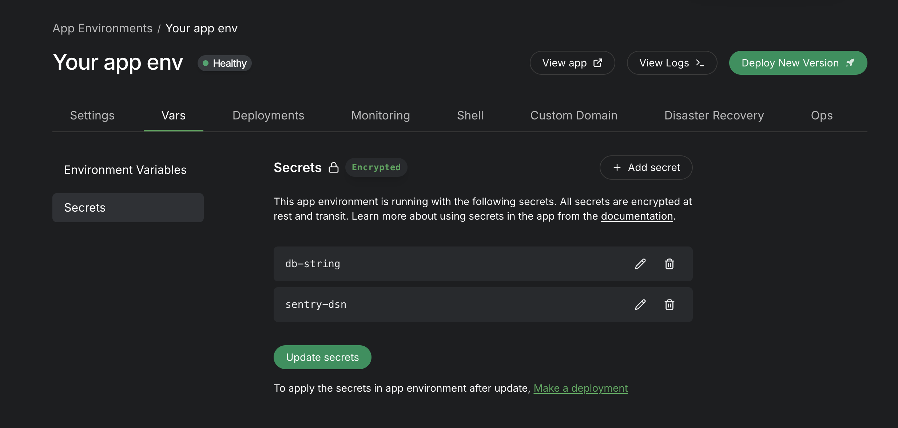
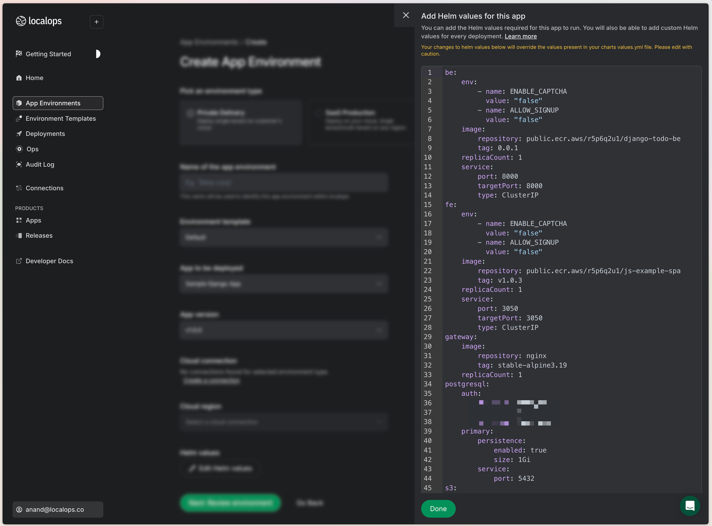
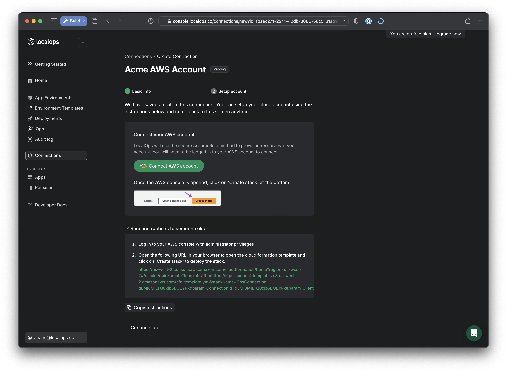
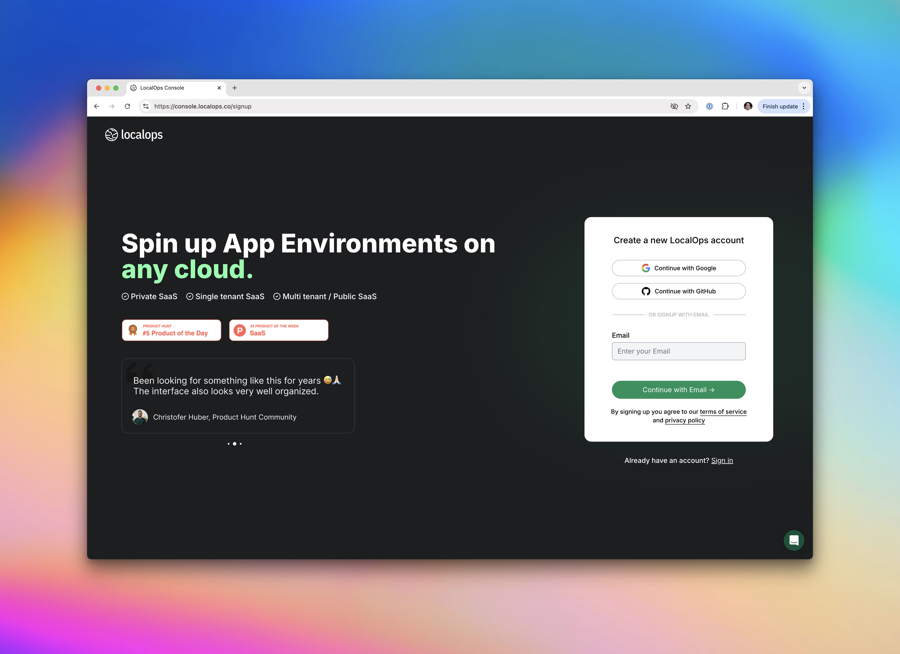
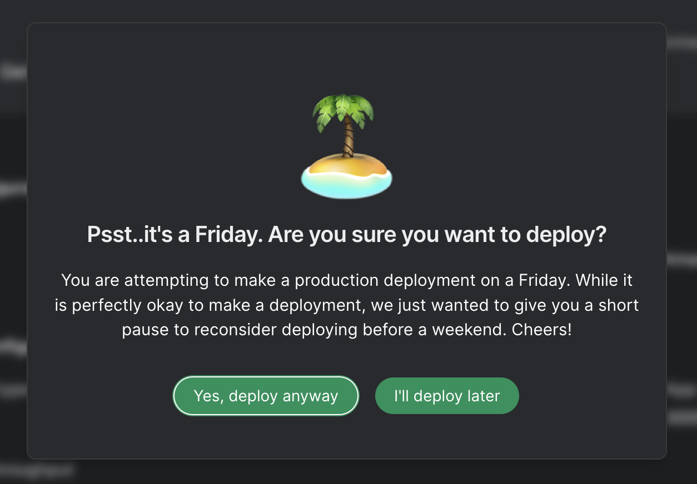
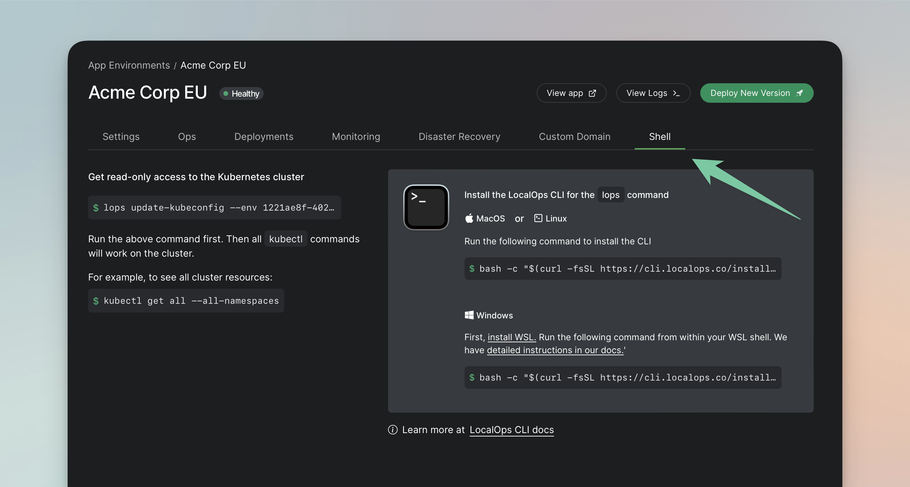

<Update label="Jan 27th, 2025">
## See CloudWatch metrics/logs in one place

When we provision environment, we provision a Grafana dashboard specific to the environment, accessible at monitor.
`<your-app-env-domain>`. You can access metrics and logs of all nodes, pods and containers running within the app
environment's kubernetes cluster.

If you are running your environment in AWS, you will also see a pre-configured CloudWatch data source in the
corresponding Grafana dashboard. You can access logs and metrics that are stored in CloudWatch.

This is super useful if your application is using managed AWS services that are sending metrics/logs to CloudWatch.

Go to “Monitor” tab in your environment to access the Grafana dashboard. Within Grafana, see Connections > Data sources
to see the Cloudwatch data source. Click on “Explore” next to it to see CloudWatch logs and metrics.

Let us know what you think. Email us at help@localops.co.

</Update>

<Update label="January 24th, 2025">
## Standard retention policy set on all logs and metrics

Every environment comes with its own unique instance of Loki + Prometheus + Grafana stack. From now, all logs and
metrics recorded by the monitoring stack have 30-day retention policy. Any log statement/metric data point is
automatically deleted after 30 days.

This significantly reduces the risk of unintentional data leaks when developers print sensitive information on logs by
accident.

</Update>

<Update label="January 23rd, 2025">
## Access any AWS managed service using IAM Role

Your app container running inside environment can now access any AWS service using IAM roles. You don’t have to
configure any IAM key/credential as secrets in your application.

LocalOps sets up a default IAM role when your environment is provisioned in the target AWS account. We set things up in
your environment such that your application will be able to use this IAM role implicitly via AWS SDK, if you declare the
`ServiceAccount` in your Helm deployment yaml spec as per our documentation.

After the environment is provisioned, you can manually add/remove relevant IAM policies to the app specific IAM role we
provisioned earlier.

</Update>

<Update label="January 14th, 2025">
## Scale environments



You can now scale up/down the underlying servers powering your environment, manually from within LocalOps console.

Visit “Scaling” tab in your environment page to pick a supported Node type (EC2 instance type in case of AWS) and save.
Existing worker nodes will be seamlessly replaced by new set of worker nodes.

You can also set a higher number of Node count. New worker nodes wll get provisioned automatically within a minute or
two.

Read the announcement here: https://localops.co/blog/scale-app-environments

</Update>

<Update label="December 17th, 2024">
## Quick search in Developer docs

Quick search in Developer docs

Checkout the new search functionality in LocalOps Developer docs.

You click on search bar in the top right corner or press CMD+K to then search for any term and it will take you to the
correct topic page instantly. It will even remember your past searches if you search within the same browser next time.

</Update>

<Update label="December 17th, 2024">
## Quick search in Developer docs

Checkout the new search functionality in LocalOps Developer docs.

You click on search bar in the top right corner or press CMD+K to then search for any term and it will take you to the
correct topic page instantly. It will even remember your past searches if you search within the same browser next time.

See https://docs.localops.co now.


</Update>

<Update label="December 2nd, 2024">
## Pass Encrypted Secrets



Pass API keys, certificates, auth token and other confidential information to your environment as secrets from within
Vars tab. All secrets are encrypted and stored in the destination/target cloud account and later get passed inside the
Kubernetes cluster as encrypted secrets.

Pass up to 100 key value pairs as secrets. Learn more at https://localops.co/blog/manage-application-secrets.

</Update>

<Update label="October 22nd, 2024">
## Set Environment vars



Developers can now set environment variables in the brand new Yaml editor:

Lookout for `Edit helm values` button.

Documentation - https://docs.localops.co/bring-your-helm-charts/env-vars

</Update>

<Update label="October 16th, 2024">
## Connect to AWS without IAM keys



We no longer accept IAM access keys to connect to AWS accounts.

We have shipped a new secure 1-click setup process to connect to AWS accounts using IAM roles and OIDC protocol. This
ensures that all access is done using short term keys created and destroyed by AWS.

AWS accounts can be connected using 1-click from Connections tab. Learn more at https://docs.localops.co/accounts/aws

</Update>

<Update label="September 3rd, 2024">
## One click signup



Users can now Sign up or Sign In to LocalOps with 1-click, using a Github or Google account. Checkout
https://console.localops.co/

</Update>

<Update label="Aug 28th, 2024">
## Friday warnings

When you create a new environment or make a new Deployment on an existing environment, you will get a warning like this:



And we are now fully integrated with Stripe to collect recurring payments. Go ahead and subscribe from your Billing
section inside Account settings ✌️.

</Update>

<Update label="Aug 13th, 2024">
## Introducing LocalOps CLI v1

If you want to inspect your environment & its backing kubernetes cluster, say to check if your application’s pods are
running healthy, use Localops CLI to do it.

Just install it in your local dev machine and use its update-kubeconfig sub-command to set correct kubernetes context of
your local kubectl system. Then, you can run any kubectl command to inspect objects running in the specific app
environment's kubernetes cluster.

Checkout the new `Shell` tab in environment page to find out more 😎.



Run this command in your Terminal to install LocalOps CLI in your Mac:

```bash
bash -c "$(curl -fsSL https://cli.localops.co/install.sh)"
```

Learn more at https://docs.localops.co/cli

</Update>

<Update label="Aug 6th, 2024">
We ship every Tuesday 🚀. Just so that you know

At LocalOps, we are super serious about Data Privacy. We have made it our mission to build tools for the Internet 🌐 to
support Private App deployments / Private SaaS deployments.

These days, we have begun reaching out to our signups to either check if they need assistance in their first steps with
LocalOps or send out product updates from time to time. So, we are asking for user's explicit consent during our
[Signup](https://console.localops.co/signup) process to reach out to them in these ways.

In addition, we fixed a bunch of stuff that kept annoying us more than ever. Starting with Email Notifications.

All Environments ([What is an Environment?](https://docs.localops.co/environment/inside)) get a free ssl cert and a
subdomain on \*.localops.run domain by default. They become instantly accessible and publicly shareable on the internet
once they are up. It takes roughly 18-20mins to provision an Environment on the cloud, say AWS today. So we inform users
via email after their environment is fully provisioned & ready to accept requests. Sometimes, this email went out before
the App got fully deployed within the environment and this was quite misleading! We finally fixed this bug 🐛 this week.

Next up - we are planning to introduce support for AWS RDS, AWS Elastic Cache and other managed database services on
AWS. Users could declare them as their dependencies and have them created in each environment they create for their App.
We already support Amazon S3 and we have laid [foundations](https://docs.localops.co/environment/services/aws/s3) to
support even more services in future. Not just in AWS but in Google Cloud and Azure as well.

But, a major blocker here was that we couldn't enable Multi-AZ (Availability Zone) fallback for a DB cluster, say in
RDS, unless we had 3 AWS private subnets in 3 unique AZs available in each environment. We improved our implementation
to spin up 3 subnets instead of 2 subnets this week. LocalOps would connect to the target cloud account, query for
available subnets and available AZs in that account, picks 3 AZs programmatically and spin up subnets in each of those
AZs. 😎 Isn't this cool?

There is a bunch of other new things we are building to make Private SaaS deployments easy.

[Get Started](https://localops.co) with LocalOps here by signing up for a free trial. And start deploying your app on
any cloud for any customer within minutes. Every account gets 100 free hours on sandbox environment every single month.

Or [schedule a demo](https://cal.com/anand-localops/founder-connect) if you want us to get you started.

</Update>

<Update label="June 30th, 2024">
## Spinning up cloud resources dynamically?

This release is BIG if you are spinning up cloud resources dynamically from your application. Read on!

App environments run in a cloud account (say AWS) that belongs to you or your customer. For each app environment you
spin up using LocalOps, a dedicated network is provisioned in a specific region within the connected cloud account. And
safe/useful defaults are set during the process.

This information about the dedicated network, the cloud region, the defaults and everything else is useful for the
application in many scenarios. For example, to dynamically provision cloud resources such as EBS volumes, EC2 instances
at run time from your application.

So we have begun to pass this surrounding context / network / cloud information to your application as additional Helm
values. These can be further consumed by your application as Environment variables as appropriate.

We also send other information to your application such as App version. So that you can do update checks, license checks
etc., as needed.

Checkout our [Developer documentation](https://docs.localops.co) to learn more.

Other update:

We moved to [Cloudflare Turnstile](https://www.cloudflare.com/en-in/application-services/products/turnstile/) to get
users signed up and logged in pretty fast. H-Captcha was relatively more stringent and introduced more friction.

🚀 [Get Started with LocalOps](https://console.localops.co/signup) now, to automate cloud deployments, especially if you
deploy applications on end customers cloud / Private SaaS deployments.

Take a [30-min demo](https://cal.com/anand-localops/founder-connect), if you have specific questions 😄

Cheers.

</Update>

<Update label="June 20th, 2024">
## Help is here! One hundred articles out

As we head for our launch in Product Hunt and other communities later this quarter, we wanted to make LocalOps platform
self serve and super obvious for developers to get started with.

So our team doubled down on Developer documentation past week. And wrote a ton of example code, documentation, manuals
and help articles.

We did count them and we produced ~100 articles across our Help center and Developer documentation.

Checkout our developer documentation here - https://docs.localops.co and help center here - https://help.localops.co.

We didn't stop there 👆.

We shipped example full stack applications using ReactJS on the Front end and Python / NodeJS / Golang on the backend,
to guide developers using one of these stacks to package their application as Helm chart and bring their applications to
LocalOps.

Checkout example repositories here:

- NodeJS - https://github.com/localopsco/node-todo-example
- Python/Django - https://github.com/localopsco/django-todo-example
- Golang - https://github.com/localopsco/go-sample-app

If someone is not using ReactJS, there are other examples available as well in our developer docs:

- Angular: https://docs.localops.co/guides/spa/angular
- Ember: https://docs.localops.co/guides/spa/ember
- VueJS: https://docs.localops.co/guides/spa/vue

(Soon) LocalOps GPT:

We may create our official GPT sometime. And publish it on GPT marketplace for our users to add us, ask questions
directly within ChatGPT interface 😇.

Stay tuned!

Subscribe to this blog Subscribe to this blog (bottom left) to read these posts right in your inbox whenever we publish
next time.

Get started for FREE on LocalOps: Start deploying your Apps as App environments across any cloud.

Sign up for an account at LocalOps for free, to create production ready app environments in your cloud or your
customer's cloud: https://console.localops.co/signup. Every account gets 100 hours free on Sandbox environments every
month.

If you want a personalised demo, [schedule a call](https://cal.com/anand-localops/founder-connect) with us here.

We consider Documentation as our product too. We want to make it easy for Developers & DevOps teams to find what they
need and quickly move on.

We will continue investing a lot of our time to make Developer documentation super rich.

</Update>
