<Update label="December 17th, 2024">
## Quick search in Developer docs

Quick search in Developer docs

Checkout the new search functionality in LocalOps Developer docs.

You click on search bar in the top right corner or press CMD+K to then search for any term and it will take you to the
correct topic page instantly. It will even remember your past searches if you search within the same browser next time.

</Update>

<Update label="December 17th, 2024">
## Quick search in Developer docs

Checkout the new search functionality in LocalOps Developer docs.

You click on search bar in the top right corner or press CMD+K to then search for any term and it will take you to the
correct topic page instantly. It will even remember your past searches if you search within the same browser next time.

See https://docs.localops.co now.


</Update>

<Update label="December 2nd, 2024">
## Pass Encrypted Secrets

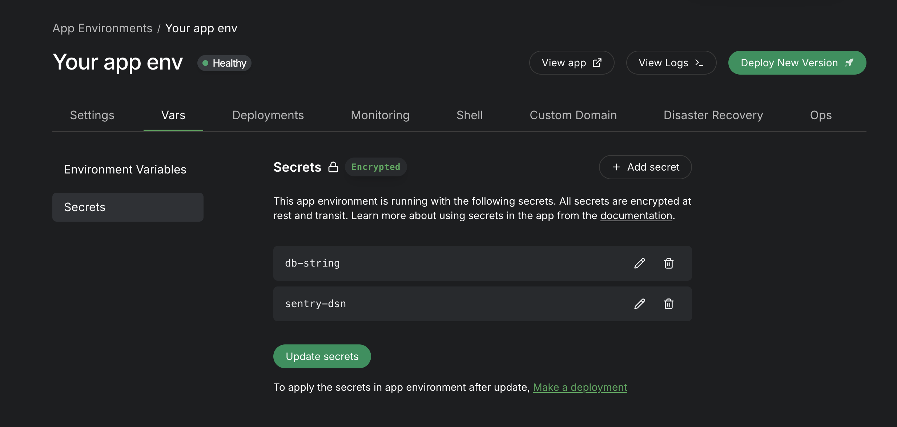

Pass API keys, certificates, auth token and other confidential information to your environment as secrets from within
Vars tab. All secrets are encrypted and stored in the destination/target cloud account and later get passed inside the
Kubernetes cluster as encrypted secrets.

Pass up to 100 key value pairs as secrets. Learn more at https://localops.co/blog/manage-application-secrets.

</Update>

<Update label="October 22nd, 2024">
## Set Environment vars

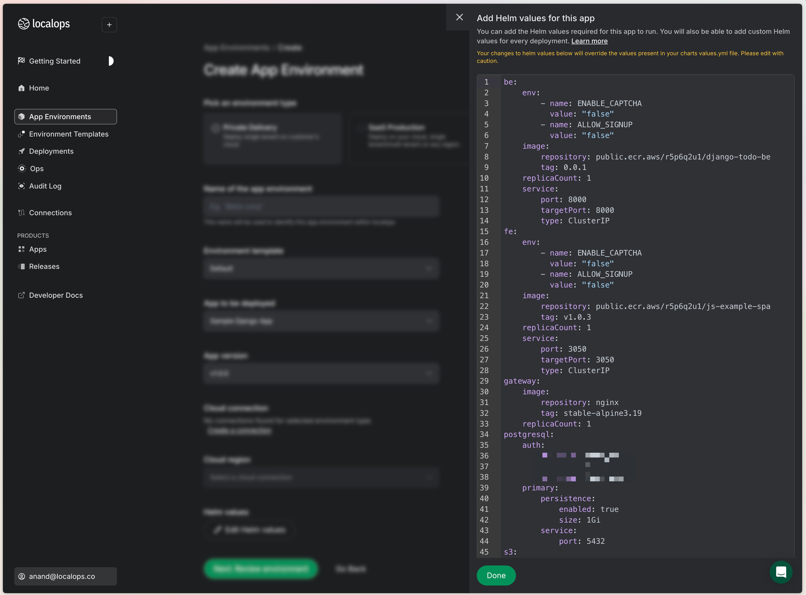

Developers can now set environment variables in the brand new Yaml editor:

Lookout for `Edit helm values` button.

Documentation - https://docs.localops.co/bring-your-helm-charts/env-vars

</Update>

<Update label="October 16th, 2024">
## Connect to AWS without IAM keys

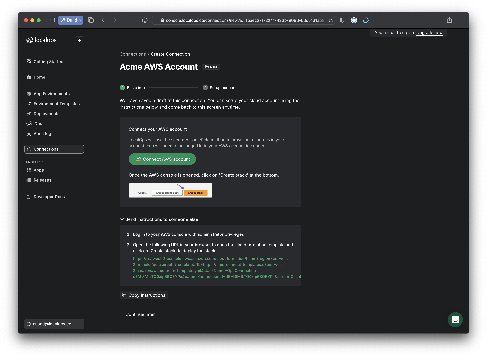

We no longer accept IAM access keys to connect to AWS accounts.

We have shipped a new secure 1-click setup process to connect to AWS accounts using IAM roles and OIDC protocol. This
ensures that all access is done using short term keys created and destroyed by AWS.

AWS accounts can be connected using 1-click from Connections tab. Learn more at https://docs.localops.co/accounts/aws

</Update>

<Update label="September 3rd, 2024">
## One click signup

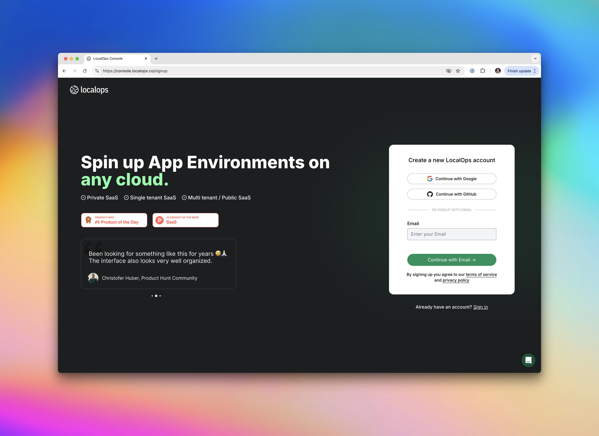

Users can now Sign up or Sign In to LocalOps with 1-click, using a Github or Google account. Checkout
https://console.localops.co/

</Update>

<Update label="Aug 28th, 2024">
## Friday warnings

When you create a new environment or make a new Deployment on an existing environment, you will get a warning like this:

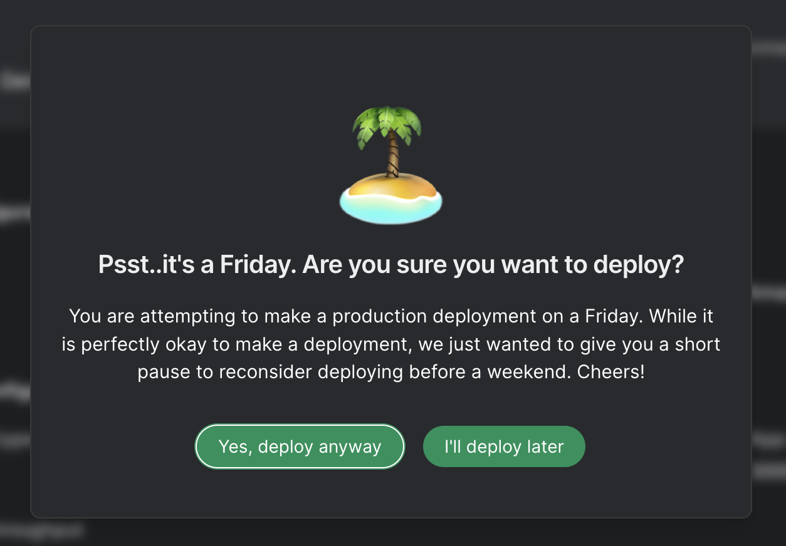

And we are now fully integrated with Stripe to collect recurring payments. Go ahead and subscribe from your Billing
section inside Account settings ✌️.

</Update>

<Update label="Aug 13th, 2024">
## Introducing LocalOps CLI v1

If you want to inspect your environment & its backing kubernetes cluster, say to check if your application’s pods are
running healthy, use Localops CLI to do it.

Just install it in your local dev machine and use its update-kubeconfig sub-command to set correct kubernetes context of
your local kubectl system. Then, you can run any kubectl command to inspect objects running in the specific app
environment's kubernetes cluster.

Checkout the new `Shell` tab in environment page to find out more 😎.

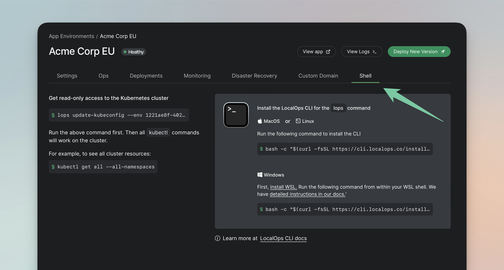

Run this command in your Terminal to install LocalOps CLI in your Mac:

```bash
bash -c "$(curl -fsSL https://cli.localops.co/install.sh)"
```

Learn more at https://docs.localops.co/cli

</Update>

<Update label="Aug 6th, 2024">
We ship every Tuesday 🚀. Just so that you know

At LocalOps, we are super serious about Data Privacy. We have made it our mission to build tools for the Internet 🌐 to
support Private App deployments / Private SaaS deployments.

These days, we have begun reaching out to our signups to either check if they need assistance in their first steps with
LocalOps or send out product updates from time to time. So, we are asking for user's explicit consent during our
[Signup](https://console.localops.co/signup) process to reach out to them in these ways.

In addition, we fixed a bunch of stuff that kept annoying us more than ever. Starting with Email Notifications.

All Environments ([What is an Environment?](https://docs.localops.co/environment/inside)) get a free ssl cert and a
subdomain on \*.localops.run domain by default. They become instantly accessible and publicly shareable on the internet
once they are up. It takes roughly 18-20mins to provision an Environment on the cloud, say AWS today. So we inform users
via email after their environment is fully provisioned & ready to accept requests. Sometimes, this email went out before
the App got fully deployed within the environment and this was quite misleading! We finally fixed this bug 🐛 this week.

Next up - we are planning to introduce support for AWS RDS, AWS Elastic Cache and other managed database services on
AWS. Users could declare them as their dependencies and have them created in each environment they create for their App.
We already support Amazon S3 and we have laid [foundations](https://docs.localops.co/environment/services/aws/s3) to
support even more services in future. Not just in AWS but in Google Cloud and Azure as well.

But, a major blocker here was that we couldn't enable Multi-AZ (Availability Zone) fallback for a DB cluster, say in
RDS, unless we had 3 AWS private subnets in 3 unique AZs available in each environment. We improved our implementation
to spin up 3 subnets instead of 2 subnets this week. LocalOps would connect to the target cloud account, query for
available subnets and available AZs in that account, picks 3 AZs programmatically and spin up subnets in each of those
AZs. 😎 Isn't this cool?

There is a bunch of other new things we are building to make Private SaaS deployments easy.

[Get Started](https://localops.co) with LocalOps here by signing up for a free trial. And start deploying your app on
any cloud for any customer within minutes. Every account gets 100 free hours on sandbox environment every single month.

Or [schedule a demo](https://cal.com/anand-localops/founder-connect) if you want us to get you started.

</Update>

<Update label="June 30th, 2024">
## Spinning up cloud resources dynamically?

This release is BIG if you are spinning up cloud resources dynamically from your application. Read on!

App environments run in a cloud account (say AWS) that belongs to you or your customer. For each app environment you
spin up using LocalOps, a dedicated network is provisioned in a specific region within the connected cloud account. And
safe/useful defaults are set during the process.

This information about the dedicated network, the cloud region, the defaults and everything else is useful for the
application in many scenarios. For example, to dynamically provision cloud resources such as EBS volumes, EC2 instances
at run time from your application.

So we have begun to pass this surrounding context / network / cloud information to your application as additional Helm
values. These can be further consumed by your application as Environment variables as appropriate.

We also send other information to your application such as App version. So that you can do update checks, license checks
etc., as needed.

Checkout our [Developer documentation](https://docs.localops.co) to learn more.

Other update:

We moved to [Cloudflare Turnstile](https://www.cloudflare.com/en-in/application-services/products/turnstile/) to get
users signed up and logged in pretty fast. H-Captcha was relatively more stringent and introduced more friction.

🚀 [Get Started with LocalOps](https://console.localops.co/signup) now, to automate cloud deployments, especially if you
deploy applications on end customers cloud / Private SaaS deployments.

Take a [30-min demo](https://cal.com/anand-localops/founder-connect), if you have specific questions 😄

Cheers.

</Update>

<Update label="June 20th, 2024">
## Help is here! One hundred articles out

As we head for our launch in Product Hunt and other communities later this quarter, we wanted to make LocalOps platform
self serve and super obvious for developers to get started with.

So our team doubled down on Developer documentation past week. And wrote a ton of example code, documentation, manuals
and help articles.

We did count them and we produced ~100 articles across our Help center and Developer documentation.

Checkout our developer documentation here - https://docs.localops.co and help center here - https://help.localops.co.

We didn't stop there 👆.

We shipped example full stack applications using ReactJS on the Front end and Python / NodeJS / Golang on the backend,
to guide developers using one of these stacks to package their application as Helm chart and bring their applications to
LocalOps.

Checkout example repositories here:

- NodeJS - https://github.com/localopsco/node-todo-example
- Python/Django - https://github.com/localopsco/django-todo-example
- Golang - https://github.com/localopsco/go-sample-app

If someone is not using ReactJS, there are other examples available as well in our developer docs:

- Angular: https://docs.localops.co/guides/spa/angular
- Ember: https://docs.localops.co/guides/spa/ember
- VueJS: https://docs.localops.co/guides/spa/vue

(Soon) LocalOps GPT:

We may create our official GPT sometime. And publish it on GPT marketplace for our users to add us, ask questions
directly within ChatGPT interface 😇.

Stay tuned!

Subscribe to this blog Subscribe to this blog (bottom left) to read these posts right in your inbox whenever we publish
next time.

Get started for FREE on LocalOps: Start deploying your Apps as App environments across any cloud.

Sign up for an account at LocalOps for free, to create production ready app environments in your cloud or your
customer's cloud: https://console.localops.co/signup. Every account gets 100 hours free on Sandbox environments every
month.

If you want a personalised demo, [schedule a call](https://cal.com/anand-localops/founder-connect) with us here.

We consider Documentation as our product too. We want to make it easy for Developers & DevOps teams to find what they
need and quickly move on.

We will continue investing a lot of our time to make Developer documentation super rich.

</Update>

<Update label="July 9th, 2024">
## Announcing Multi-Cloud audit log:

Tuesdays are always special for us. We work from 3 different timezones and we come together on a single channel on every
Tuesday to make new releases.

Last week, we introduced QA role. Account owners can invite Developers and QAs within LocalOps to spin up App
environments in their cloud or customer's cloud.

🎉 Today, we shipped Audit Log.

Anyone within your LocalOps account can see who created environments in which cloud or who made deployments. This will
be super useful to ensure visibility and transparency within your team.

With this release, LocalOps becomes a central audit log of who initiated what across ALL your/customer cloud accounts
(AWS/GCP/Azure) and across ALL cloud regions.

### How does it work?

Everyone can see all actions done within the account, under "Audit log" tab.

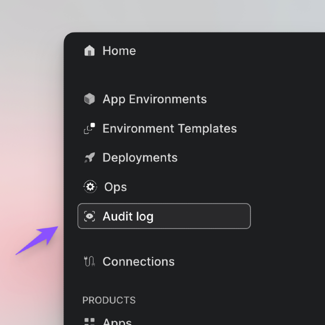

We record & show name of the user who triggered the action and the location from which they did this action.

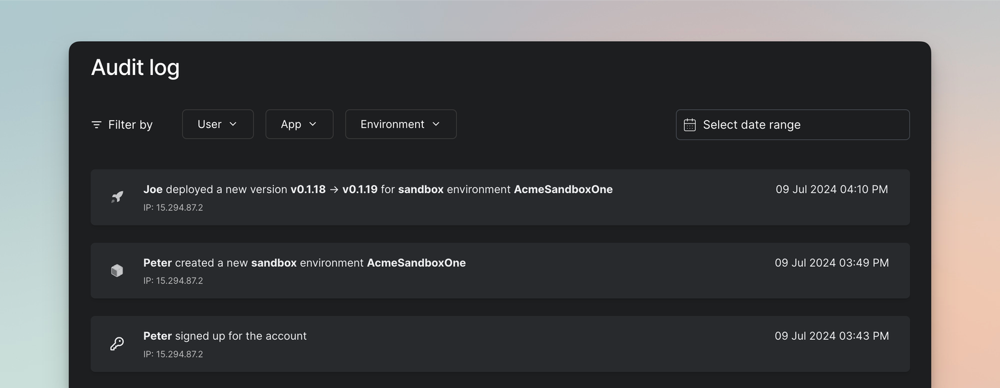

All the following actions get recorded in the Audit log.

- App creation and deletion
- Release creation and deletion
- App Environment creation & deletion
- App Deployments
- Sign in and sign out

And of course you can filter these actions by User, App or Environments.

No matter which cloud your environment is running in, all actions performed within your LocalOps account are recorded
and shown under your Audit log screen.

🤣 _Try doing the same via AWS CloudTrail in your/other AWS accounts and you will find day & night difference in Day-1
configuration and Day-N utility. Talk about doing this across multiple AWS, Google or Azure accounts you manage and you
would find how quickly things get impractical._

Get started with LocalOps today:

Want to make SaaS or Private SaaS deployments to your cloud or customer cloud from a single dashboard? [Sign up now for
a 30-day free trial][signup].

Or [book a free 30-min demo][demo] anytime and we will personally get you started with making multi-cloud deployments
across all your customers.

👋 See you next Tuesday.

</Update>

<Update label="July 2nd, 2024">

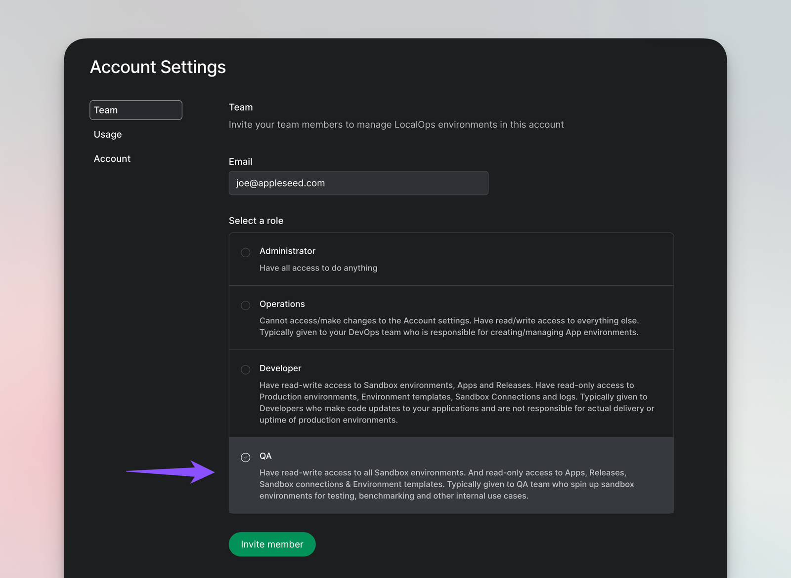

You can now invite QA team into your LocalOps account to spin up Sandbox app environments in your cloud account.

QA can create sandbox app environments in your AWS/GCP/Azure account, test all new functionality your Developers shipped
and give approval to proceed with actual production rollouts.

Sandbox environments are useful if you want to bring up an isolated & temporary cloud infrastructure to test out
application functionality in isolation. They also come handy when you want to load test applications in isolation
without interfering with anything else in the team.

QAs can spin up or tear down any number of Sandbox environments in any cloud account you set them up with. You can
invite any number of QA users within your account and let them work in isolation, without stepping on each other,
without waiting on developers to prepare their test environment and ultimately be super productive!

> FREE: Every LocalOps account gets first 100 hours for free, every single month for Sandbox environments. [Sign up for
> a free 30-day trial][signup] and manage all cloud deployments across AWS/GCP/Azure in a single place - your LocalOps
> account.

Operations team can setup Cloud connections (say your AWS account) that are dedicated for such app environments. If a
cloud connection is marked for Sandbox, they can be used to create Sandbox environments only.

</Update>

<Update label="June 25th, 2024">
We want to make it easier for you (developers) to not just deploy applications on "any cloud" (your cloud or your customer cloud / Private SaaS) but also want to let you handle customers of "any size". It could be a medium size business in Europe with 20 agents or a financial enterprise with 200 agents.

So we announced capabilities last week to let developers configure N number of servers to get created (via Environment
Template) while spinning up App environments on day 1. And that could be sufficient for many customers with predictable
workloads. It would get configured based on information one might have on day 1 on how big that deployment could end up
be.

But, come on! It's 2024. We are not living in SliceHost age. We are miles into the cloud era now and we want to be able
to expand and shrink the servers based on load.

🎉 **Enter auto-scaling!**

We have begun to setup auto-scaling by default (yup - by default!) in all App environments. No one has to learn a thing
about how do this all in a given target cloud - AWS, Azure or Google cloud. We make it happen behind the scenes in every
App environment automatically.

This release is the first in this series, starting with accepting minimum and maximum number of servers to spin up for
any app environment, via environment templates.

> Learn more about Environment templates: https://blog.localops.co/whats-new-on-june-18/

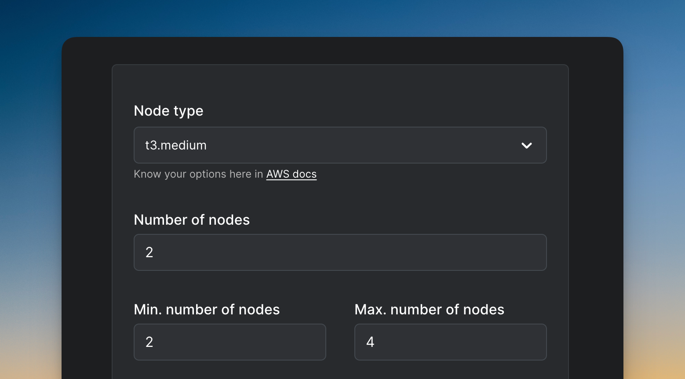

We are marching into a place where your App environments will expand when there is more load. And will shrink when the
load is low, achieving the true vision of "the cloud", resulting in enormous savings on cloud bills for you / your
customer (Private SaaS deployments). Developers can define these resource requirements in their Helm chart and configure
the min and max number of servers to create for each environment in LocalOps. LocalOps would configure Kubernetes
cluster (which is powering the App environment) to honour those rules, seamlessly. Users don't need to learn much DevOps
jargon to configure it all.

Stay tuned, we are working hard on a set of follow up releases to fully realise this vision. All while asking very
little from developers to learn or configure.

### Updates to LocalOps Documentation:

We also improved our documentation in bunch of different ways. Starting with instructions on getting cloud credentials
to connect to LocalOps. Checkout https://docs.localops.co/accounts/aws.

We consider Documentation as our product too. You will see more updates to documentation to make things extra clear for
everyone to use LocalOps.

Speaking about documentation, we have placed links to documentation throughout your account. So it will be super easy to
learn about a concept and configure App environments in a jiffy. And it will always be handy in bottom right corner in
your account:

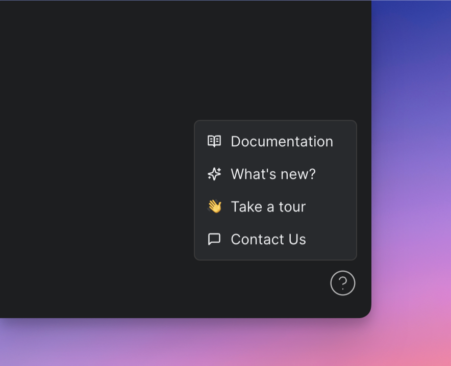

### Announcing our changelog:

You can read about weekly releases if you visit this blog at https://blog.localops.co and click on "Changelog". You can
also access our Changelog also the bottom right help menu in your account.

Please subscribe to our blog here (see bottom right) and you will receive email updates whenever we publish new posts on
our releases and more.

We did a lot of tiny improvements within your account that can make it extra clear for you to signup and deploy
applications quickly on your customer cloud or your cloud. Sign up now to take a free 30 day trial.

Take a [30-min demo](demo) with us, in case you build SaaS products and want to deploy applications in your customer
cloud or provide dedicated infrastructure to specific customer accounts within your cloud, or want to set up production
environment in AWS, say for first time.

See you next Tuesday 👋.

</Update>

<Update label="June 18th, 2024">

🎉 We shipped two new capabilities this time!

First, we made it easy for you to create identical app environments with identical infra configurations, using
Environment Templates.

### What are Environment Templates?

You get to define commonly used compute, network, storage configurations of your environments as "Environment
Templates". Whenever you create a new environment, you get to specify the template name to use, to boot up the
environment.

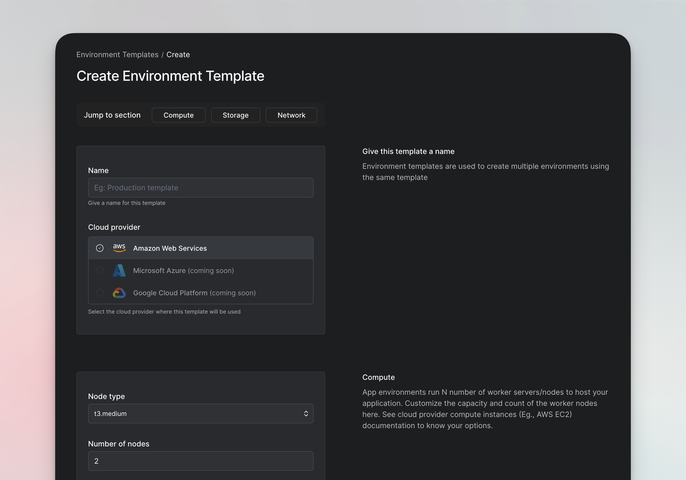

You can define a template for your internal QA environments, cloud-prem deliveries, single tenant deliveries or even
SaaS production environments.

For each app, you can go on to define ideal size configuration of the underlying worker nodes / virtual servers to start
their environments in. So that no one gets to under-provision or over-provision Cloud-prem/SaaS/QA environments by
mistake.

Environment templates are offered in all accounts without limits. [Sign up][signup] now to give LocalOps a spin

### Two Global Resource Tags:

Second, we wanted to help DevOps teams (internal/external on your customers end) to locate cloud resources that are
provisioned by LocalOps in their cloud account. And potentially calculate how much they are all adding up to the cloud
(AWS, say) bill every month.

So we came up with ✌️ two standard tags and attached them everywhere. You can use services like
[AWS Resource Explorer](https://aws.amazon.com/resourceexplorer) or
[AWS Billing console](https://aws.amazon.com/aws-cost-management/aws-billing) to filter and see resources by these two
tags.

Note: Name and value of these two tags are unique for each environment. Please copy them from environment's Settings
section:

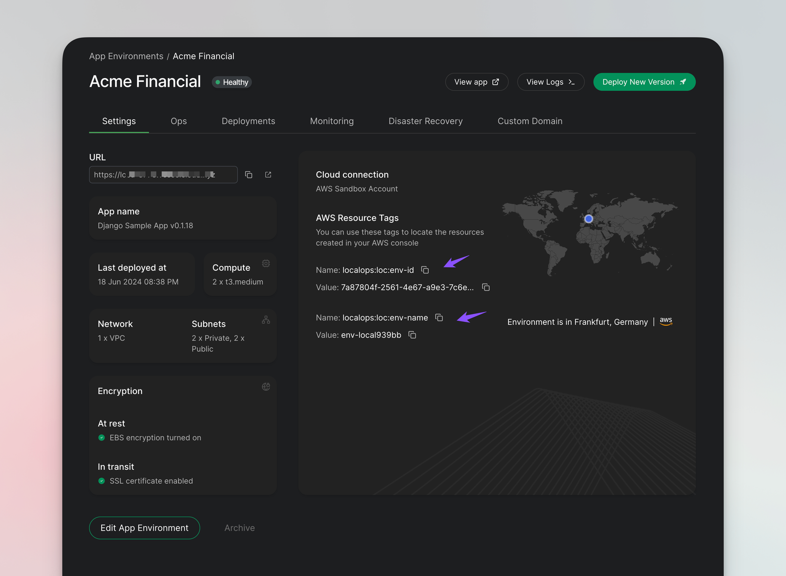

We are having a great time here in building LocalOps. We want to make it super easy and super intuitive for you to spin
up App Environments in any cloud and deploy applications in your cloud or your customer's cloud (cloud-prem deliveries).

If you want to put LocalOps to use in your organisation for making Cloud-prem deliveries in your customer cloud or for
provisioning tearable QA environments in your cloud or anything in between, please [book a 30-min demo][demo] with us.
We will get you started first hand.

Or simply [sign up][signup] anytime. There is a 30-day free trial and a very generous 100 free hours on Sandbox/QA
enivornments after that.

See you next tuesday! 👋

</Update>

[demo]: https://cal.com/anand-localops/founder-connect
[signup]: https://console.localops.co/signup
