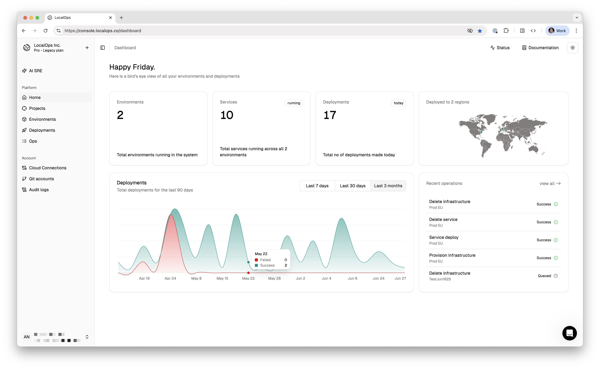
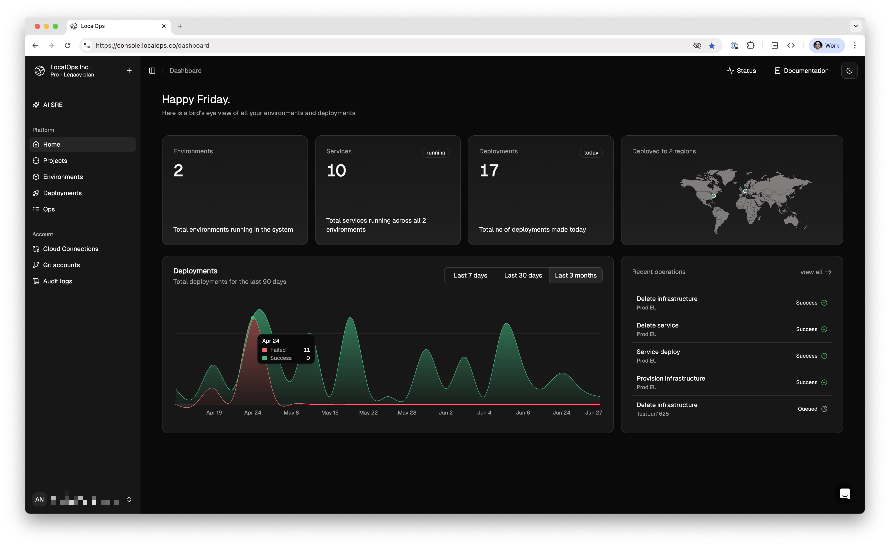
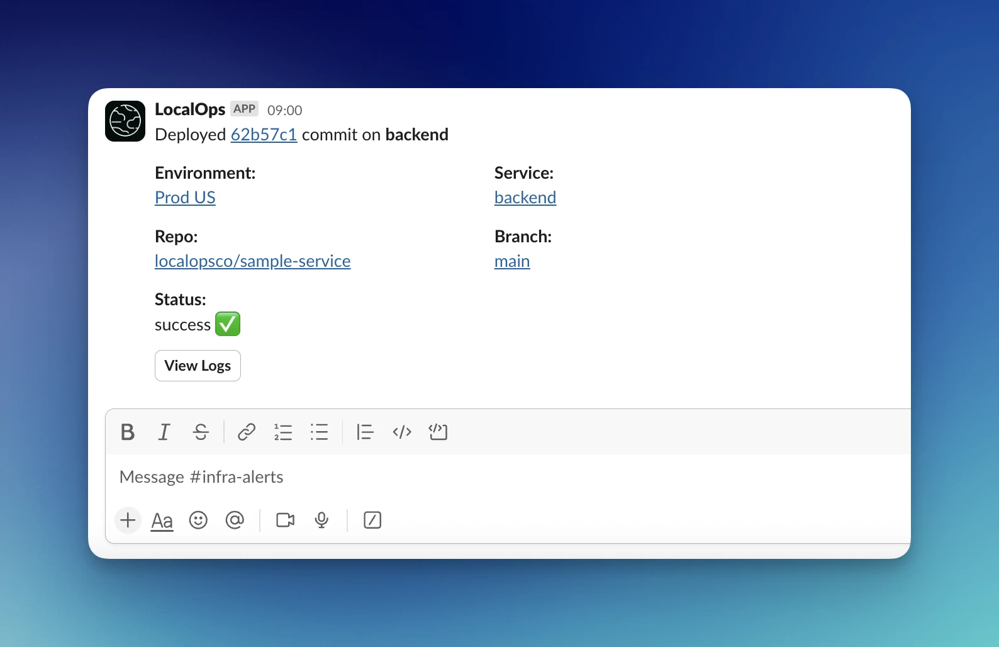
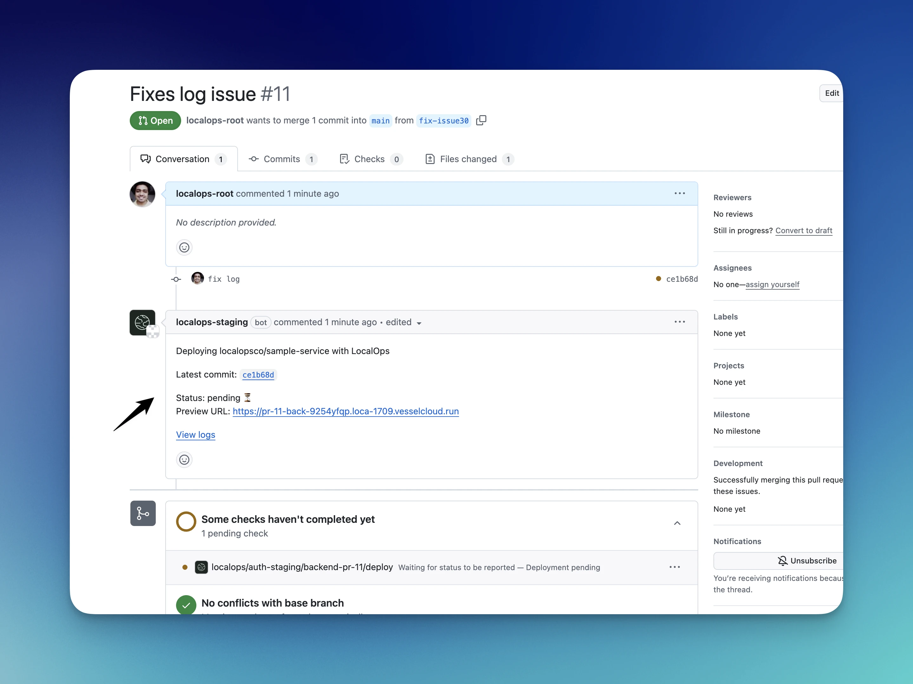
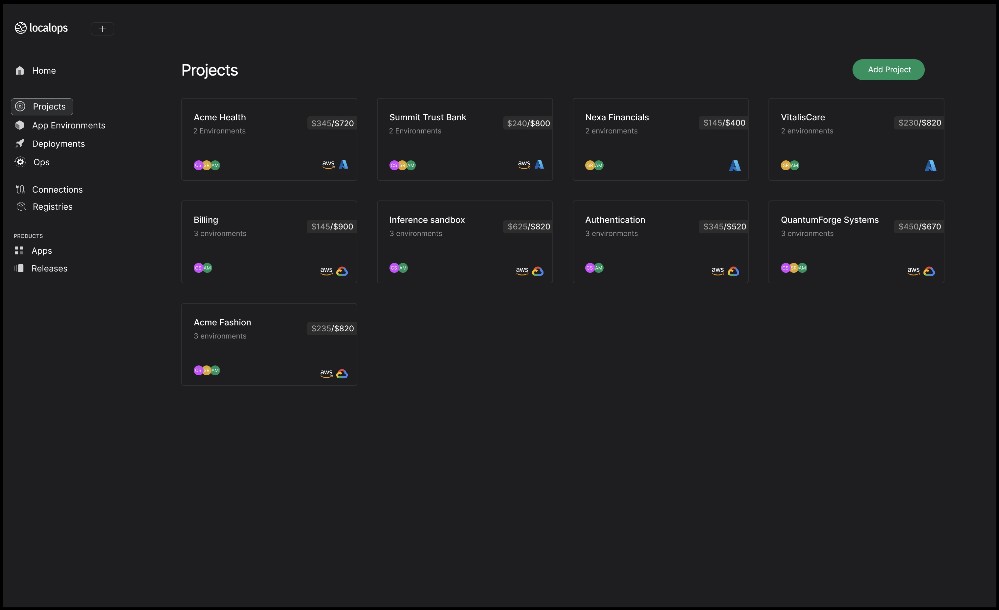
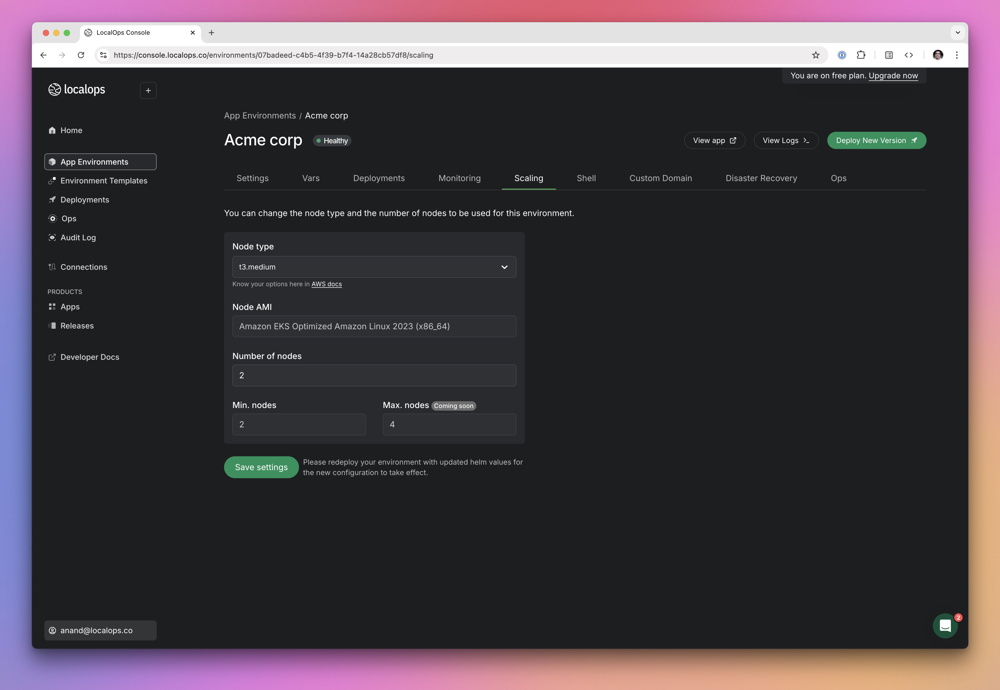

<Update label="Nov 17, 2025">

## ✨ .Net support

LocalOps can now build docker images for .Net codebase without requiring a Dockerfile in the corresponding git repo. 

Windows developers can now connect their Github repo and deploy on any AWS/GCP/Azure cloud/On-prem without writing Dockerfile, Terraform scripts or Pulumi scripts.

Read more from our [announcement](https://localops.co/blog/no-dockerfile-needed-deploy-net-containers-anywhere).


</Update>

<Update label="Nov 6, 2025">

## Bulk Import/Update secrets

When your services use lots of secrets (100s of them), it may not be ideal to add/update/delete one by one.

So we introduced bulk secrets editor in serives section. Just click on __Bulk Import__ button and paste in secrets in __KEY=VALUE__ pattern.

You can copy paste your .env files if secrets are maintained that way in your project. 

All the following operatons can be done using this editor.
1. Bulk import new secrets 
2. Bulk edit and save. Just use the same editor to update existing secrets 
3. Delete secrets in bulk

## Reveal individual secrets

In edit secret screen, you can now see existing values by clicking on __Reveal value__ link under Value field. This is handy when you want to debug issues in your environments by seeing current value of a secret or when you want to edit values with full context.

## Cancel queued deployments

Anyone can now cancel queued deployments from Deployments section. This is useful if you want to make some last minute changes before the deployment starts. Click on __Cancel__ button that appears next to each queued deployment.

Reach out to us if you want to see a quick walk through of these capabilities at https://go.localops.co/tour. 

</Update>

<Update label="Oct 24, 2025">

## Skip writing Dockerfiles. Custom ops.json. And more.

From today, your Github repositories need not have Dockerfiles in them. 

LocalOps will pull the code from Github, infer and automatically build an appropriate Docker image based on the language runtime used in the repo. All the following languages are supported as of now:

1. Node
2. Python
3. Go
4. PHP
5. HTML
6. Java
7. Ruby
8. Deno
9. Rust
10. Elixir
11. Shell scripts

If needed, a specific run command can be provided in the Service to override the default run command. Read more on the [announcement](https://localops.co/blog/deploy-your-service-on-any-customer-cloud-no-dockerfile-required).

## Custom ops.json 

LocalOps looks for `ops.json` in the root of your Git repo (See [ops.json docs](https://docs.localops.co/environment/services/ops-json)) and it can be used to configure services in advanced ways. Say, you can define cloud depndencies like s3, define cron jobs, seed/migration jobs and so on.

You can now define the same json file and name it anything or place it anywhere in the repo. Just pass the location of json file in Service settings. And LocalOps will process it in usual ways.

## Other updates

1. Services and secrets are now sorted in the alphabetical order in UI to make them more findable when having large number of services 
2. Several refinements in the UI
3. Bug fixes in setting up AWS connection

</Update>

<Update label="Oct 16, 2025">

## Define the order of services and jobs 

Each service can now define the list of components that it depends on, so that it will wait for those dependencies to come up before its containers start. This will allow devs to define the order in which services have to boot up, in any cloud environment.

These dependencies can be provided in `ops.json`. Checkout [Init documentation](https://docs.localops.co/environment/services/ops-json#init-jobs) to learn more.

## Setup health checks for services 

Each service can now get a in-environment health check. If they fail, corresponding replica/container will restart automatically.

This health check can be defined in `ops.json` - the usual service configuration file you'd maintain in the respective Git repo.

Checkout [Health check documentation](https://docs.localops.co/environment/services/ops-json#health-checks) to learn more.

## Document secrets 

In each secret, a description can now be added and that will be show in the secrets section, right next to each secret. 

In addition, the same description is shown as comment right above the exposed secrets in `Values.yaml` of the private helm charts generated by LocalOps. 

This will help end users of the Helm chart understand the meaning of each value in Values.yaml and help them configure chart installations. 

You can generate private helm charts and distribute it to your enterprise customers, from within LocalOps. We shipped quite a few refinements to handle day to day workflows.

## See total and active Helm chart installations

You can now track how many Helm chart installations have your customers done and how many such installations continue running/to be active. 

This information is shown for each license token in license tokens section. And next to each chart verion.

## Deprecate or delete helm charts

Helm charts can be marked as deprecated or deleted from within LocalOps console at any time. This is to help developer teams have control over the charts they like to offer and support. 

</Update>


<Update label="Sep 26, 2025">

## Generate Private Helm charts with 1-click

From the services you see running in your environment, you can now generate a new helm chart from within LocalOps, with 1-click. 

Go to environment dashboard, click on three dots on the top right. And click "Generate Helm Chart".

## Generate License tokens to distribute Private helm charts 

Your users can install your service using the private helm chart generated from the environment. To do so, they have to provide license tokens. 

Generate license tokens for each of your customers, from "License Tokens" section. Give each token a name and share it with relevant customer.

Charts and Docker Images won't download for users if the license token is invalid. Plus, you can call our license token validation API (set it behind your custom domain in account settings) from code to identify if the token expired. So that you can stop services as appropriate for that customer.

Learn more in [documentation](https://docs.localops.co/no-access-delivery/license-tokens).

### byoc.yourcompany.com

For the charts you generate, you can generate a Installation guide for your customers at byoc.yourcompany.com. Just turn on Installation URL for the chart and set a custom domain in Account settings.

Read more from our [announcement](https://localops.co/blog/byoc-yourcompany-com-generate-and-host-private-helm-charts-with-1-click).

</Update>

<Update label="Sep 9, 2025">

## Run any Helm Chart as service

You can now spin up a new service using any public Helm Chart.

While creating a new service, just pick "Helm chart" as the Source and provide

1. Helm repo url
2. Helm chart name
3. Values.yaml

And trigger a new deployment. While triggering a new deployment, provide the specific version to run.

You can edit your current service in Service > Settings section and update Helm Values to customise your deployment.

### Interacting with the chart and its internal services:

Say you want to run Postgresql as a service using its Helm chart.

#### Case 1: Other services to use chart's services

Say you want your NodeJS app to use Postgres as its database.

The other service (NodeJS service) from the same environment can use Postgresql database running as part of the Helm
Chart installation. Using "service alias" of the helm chart, one can frame the hostname for the chart's service
(postgresql) using the format below.

```
$chart_svc_alias/service/<service-name>
```

And this can be given as value in any Secret added in secret section. Your code can use it as `hostname` for the
corresponding service.

`<service-name>` is the name of the service that is running as part of Helm chart installation and is of type `NodePort`
or `ClusterIP`. Refer to your Helm chart's documentation to find the `<service-name>`.

For our current example: You can add this as DB_HOST secret under secrets section of the NodeJS app service and use it
in your code via env var.

```
$chart_svc_alias/service/postgresql
```

#### Case 2: Charts to use another chart's services

Say you want to use Temporal and want it to use Postgres as its database.

A Helm chart running within the same environment as a service, can use services running as part of another helm chart by
using their service alias as an alias for hostname. And provide them as below in Values.yaml configuration.

```yaml
database:
  host: { { hosts "$other_chart_svc_alias/service/<service-name>" } }
```

Any Values.Yaml configuration can have go-template style expressions wrapped in `{{` and `}}`.

`hosts` here is a helper function we support today that can bring the internal dns hostname of any service running
within the same LocalOps environment.

For current example, run Temporal chart and Postgres chart as services within your LocalOps environemnt. And provide the
following in Temporal chart's values.yaml configuration.

```yaml
default:
  driver: sql
    sql:
      driverName: postgres
      host: {{ hosts "$pg_chart_svc_alias/service/postgresql" }}
      port: 5432
```

</Update>

<Update label="Aug 29, 2025">

## Run any Docker Image as service

You can now spin up a service using any pre-built docker image.

While creating a new service, just pick Docker Image as source and provide

1. Docker registry url
2. Docker image name

And trigger a new deployment. You can pick a specific version to run, while triggering new deployment. Default
version/tag: `latest`.

All options supported in a traditional service are supported in Docker image services also. You can:

1. Run it as `web`, `worker`, `internal` service, `job` or `cron`.
2. Configure environment variables and secrets
3. Specific resource requirements like CPU and Memory
4. Run any number of copies of the container to scale it based on load
5. Attach custom domain if the service is of type `web`.

Read announcement on our [blog here](https://localops.co/blog/run-any-docker-image-as-a-service)

</Update>

<Update label="July 30, 2025">

## Ephemeral database, queues, cache and workers for Preview environments

You can now spin up temporary copies of databases, cache and queue servers for every PR you test using preview
environments.

### Supported services:

Databases:

1. MySQL
2. Postgres

Cache services:

1. Redis
2. Memcache

Queues:

1. RabbitMQ

Email us at help@localops.co if you need support for more services.

Read announcement on our
[blog post](https://localops.co/blog/ephemeral-db-cache-queues-workers-for-preview-environments) Learn more from
[documentation](https://docs.localops.co/use-cases/ephemeral#isolated-database%2C-cache%2C-queues-and-workers)

</Update>

<Update label="June 27, 2025">

## New UI, 1-click service deployments and more

We shipped a brand new UI this week. It is based out of a consisent and modern design language which allows devs to
navigate between environments & services faster. And we believe it looks way more cleaner and sexier than ever.

It does come in light and dark themes so you can pick what you prefer. Sign in to LocalOps again and let us know what
you think!





### 1 click service deployments:

From now, you can trigger a new deployment directly from the same place where you create the service. Earlier, this was
a separate step after the service is created. This minor change allows devs to spin up the new service instantly without
having to perform any other step.

Plus we took this opportunity to make a ton of bug fixes throughout the console that makes the overall experience far
more stable than ever.

</Update>

<Update label="June 18, 2025">
## Rollback deployments

You can now roll back to any previous commit directly from the LocalOps console.

In Services > deployments tab, just press on the "Re-deploy" button in any of the past successful deployments. We’ll
fetch that commit, rebuild, and redeploy it—restoring your app exactly as it was.

Previously, we relied on developers to push a new commit to reverse changes. But in reality, that’s often painful.
Reverting complex changes in a fresh commit isn’t always straightforward.

So we’ve built an explicit rollback mechanism—a safer, cleaner, and faster way to go back to a known-good version.

Read more on our release [blog post here](https://localops.co/blog/spin-up-cloud-resources-using-json).

</Update>

<Update label="June 9, 2025">
## Configure cloud resources using ops.json

You can add a new file called `ops.json` in your Git repo to declare cloud resources for services to use. Including AWS
S3 buckets, SNS topics, SQS queues, RDS instances, ElasticCache clusters etc.,

LocalOps will provision these resources in your cloud account with production grade security, when the corresponding
service is deployed.

```json
{
  "dependencies": {
    "s3": {
      "buckets": [
        {
          "id": "test123",
          "prefix": "testdep123",
          "exports": {
            "MY_BUCKET_NAME1": "$name",
            "MY_BUCKET_ARN1": "$arn"
          }
        }
      ]
    }
  }
}
```

Read our [documentation](https://docs.localops.co/environment/services/ops-json). Or read the release
[blog post here](https://localops.co/blog/spin-up-cloud-resources-using-json).

</Update>

<Update label="May 29, 2025">
## Introducing AI Code reviews

We are releasing a beta version of AI code reviews today in LocalOps to let code reviews be a blissful process in your
team instead of being a necessary bottleneck.

You can turn on AI code reviews when you create a new service within LocalOps. Just flip this switch and our AI will
start listening on all your pull requests.


When your team creates new PRs or pushes new commits to their existing PRs, a detailed review will be triggered to scan
through all changes and add comments on the correct file and line number.


Read more in our [blog post](https://localops.co/blog/introducing-ai-code-reviews).

</Update>

<Update label="May 22, 2025">
## Introducing Slack Integration

Your teams can now receive alerts in a dedicated slack channel for all your deployments across all services. Just go to
Account settings > Integrations page to connect your slack workspace.



Read more in our [blog post](https://localops.co/blog/introducing-slack-integration).

</Update>

<Update label="May 13, 2025">
## Introducing Ephemeral environments for Pull requests

We just pushed a major capability today.

We have released Pull request previews today to unblock your team to deploy, test each pull request in an isolated
setup. In your current app environment, say you have two services

- backend
- frontend

Say backend service is pointed at code in main branch of backend repo. If anyone in your team raises a pull request in
github, targeting to merge fix-issue30 branch into main branch, LocalOps pulls and builds the latest commit from the
pull request branch fix-issue30 , creates a new preview service with the latest commit and run it in its own SSL powered
URL.



Read more in our [blog post](https://localops.co/blog/introducing-pull-request-previews).

</Update>

<Update label="May 9, 2025">
## Faster builds + Deploy Microservices and Cloud Resources on AWS

#### Faster builds

We just pushed a major change to our build setup today.

From now, the build infrastructure that pulls your code & builds the docker image out of your Dockerfile, is dedicated,
isolated & different from the infrastructure used by your neighbouring accounts within LocalOps. This means that when
you push your code, it gets pulled and built right away. Builds no longer have to wait for their turn.

#### Deploy Micro Services

Each service that exposes a port, gets a new unique `service alias`. It is a string that you can see in Service screen
and which you can use as an alias for the specific service’s internal DNS host name.

You can add this `service alias` as a `secret` in the dependent service. At run time, LocalOps replaces that string with
the actual internal DNS host name. Your code can simply consume the secret as environment variable and connect to the
service.

Learn more in our docs here - https://docs.localops.co/micro-services

#### Extend with cloud resources

You may want to create RDS database, S3 bucket, SNS topic or a SQS queue to fulfill business logic. We wanted to make
this process easier so that you can write Terraform or Pulumi scripts to create these resources for each of your
environments. So we have exposed VPC and subnet IDs that we provision and manage in your AWS account. You can use these
IDs as variables in your IaC stack (Terraform/Pulumi/OpenTofu) to create any cloud resource you need in AWS.

Read more in our
[blog post](https://localops.co/blog/what-s-new-on-may-9-deploy-microservices-spas-and-cloud-services-fast).

</Update>

<Update label="Apr 25, 2025">
## Announcing Continuous deployments with Github Integration

You can now connect your Github repositories and deploy just by doing git-push.

To get started, spin up a new environment and create a new **Service**. When you create a new service, configure a
specific git repository and branch name. Whenever your team pushes new code to that branch, LocalOps will automatically
pull the latest commit, build and push a new deployment to your environment. We will show build & deployment logs right
there in the UI.

You can create any number of services for any purpose:

- Web service - Front end or back end
- Internal service
- Worker
- Job
- Cron job

Read more about this feature in our
[blog post](https://localops.co/blog/announcing-continuous-deployments-with-github-integration).

</Update>

<Update label="Mar 5th, 2025">
## Introducing Projects

🎉 We are introducing "Projects" to organize environments by teams, environments, services, customers, regions, etc.,
You can create a project for:

- Different module teams - Inference, Billing, Auth, Frontend, Backend, etc.,
- Production/staging environments - EU, US, AUS, etc.,
- Different customers - in the case of single tenant environments like Customer1-EU, Customer2-AWS, etc.,

Each of these projects could have multiple staging, prod environments inside: 

</Update>

<Update label="Jan 27th, 2025">
## See CloudWatch metrics/logs in one place

When we provision environment, we provision a Grafana dashboard specific to the environment, accessible at monitor.
`<your-app-env-domain>`. You can access metrics and logs of all nodes, pods and containers running within the app
environment's kubernetes cluster.

If you are running your environment in AWS, you will also see a pre-configured CloudWatch data source in the
corresponding Grafana dashboard. You can access logs and metrics that are stored in CloudWatch.

This is super useful if your application is using managed AWS services that are sending metrics/logs to CloudWatch.

Go to “Monitor” tab in your environment to access the Grafana dashboard. Within Grafana, see Connections > Data sources
to see the Cloudwatch data source. Click on “Explore” next to it to see CloudWatch logs and metrics.

Let us know what you think. Email us at help@localops.co.

</Update>

<Update label="January 24th, 2025">
## Standard retention policy set on all logs and metrics

Every environment comes with its own unique instance of Loki + Prometheus + Grafana stack. From now, all logs and
metrics recorded by the monitoring stack have 30-day retention policy. Any log statement/metric data point is
automatically deleted after 30 days.

This significantly reduces the risk of unintentional data leaks when developers print sensitive information on logs by
accident.

</Update>

<Update label="January 23rd, 2025">
## Access any AWS managed service using IAM Role

Your app container running inside environment can now access any AWS service using IAM roles. You don’t have to
configure any IAM key/credential as secrets in your application.

LocalOps sets up a default IAM role when your environment is provisioned in the target AWS account. We set things up in
your environment such that your application will be able to use this IAM role implicitly via AWS SDK, if you declare the
`ServiceAccount` in your Helm deployment yaml spec as per our documentation.

After the environment is provisioned, you can manually add/remove relevant IAM policies to the app specific IAM role we
provisioned earlier.

</Update>

<Update label="January 14th, 2025">
## Scale environments



You can now scale up/down the underlying servers powering your environment, manually from within LocalOps console.

Visit “Scaling” tab in your environment page to pick a supported Node type (EC2 instance type in case of AWS) and save.
Existing worker nodes will be seamlessly replaced by new set of worker nodes.

You can also set a higher number of Node count. New worker nodes will get provisioned automatically within a minute or
two.

Read the announcement here: https://localops.co/blog/scale-app-environments

</Update>

For the previous year, check out [2024](/changelogs/2024)

[demo]: https://cal.com/anand-localops/founder-connect
[signup]: https://console.localops.co/signup
