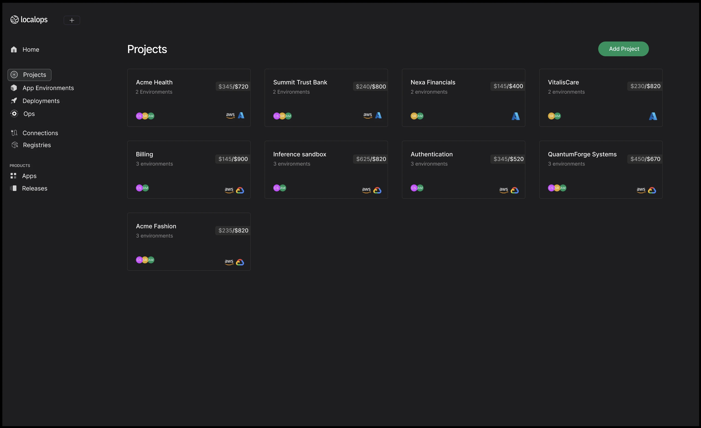

<Update label="June 9, 2025">
## Configure cloud resources using ops.json

You can add a new file called `ops.json` in your Git repo to declare cloud resources for serivices to use. Including AWS
S3 buckets, SNS topics, SQS queues, RDS instances, Elastic cache clusters etc.,

LocalOps will provision these resources in your cloud account with production grade security, when the corresponding
service is deployed.

```json
{
  "dependencies": {
    "s3": {
      "buckets": [
        {
          "id": "test123",
          "prefix": "testdep123",
          "exports": {
            "MY_BUCKET_NAME1": "$name",
            "MY_BUCKET_ARN1": "$arn"
          }
        }
      ]
    }
  }
}
```

Read our [documentation](https://docs.localops.co/environment/services/ops-json). Or read the release
[blog post here](https://localops.co/blog/spin-up-cloud-resources-using-json).

</Update>

<Update label="May 29, 2025">
## Introducing AI Code reviews

We are releasing a beta version of AI code reviews today in LocalOps to let code reviews be a blissful process in your
team instead of being a necessary bottleneck.

You can turn on AI code reviews when you create a new service within LocalOps. Just flip this switch and our AI will
start listening on all your pull requests.


When your team creates new PRs or pushes new commits to their existing PRs, a detailed review will be triggered to scan
through all changes and add comments on the correct file and line number.


Read more in our [blog post](https://localops.co/blog/introducing-ai-code-reviews).

</Update>

<Update label="May 22, 2025">
## Introducing Slack Integration

Your teams can now receive alerts in a dedicated slack channel for all your deployments across all services. Just go to
Account settings > Integrations page to connect your slack workspace.


Read more in our [blog post](https://localops.co/blog/introducing-slack-integration).

</Update>

<Update label="May 13, 2025">
## Introducing Ephemeral environments for Pull requests

We just pushed a major capability today.

We have released Pull request previews today to unblock your team to deploy, test each pull request in an isolated
setup. In your current app environment, say you have two services

- backend
- frontend

Say backend service is pointed at code in main branch of backend repo. If anyone in your team raises a pull request in
github, targeting to merge fix-issue30 branch into main branch, LocalOps pulls and builds the latest commit from the
pull request branch fix-issue30 , creates a new preview service with the latest commit and run it in its own SSL powered
URL.


Read more in our [blog post](https://localops.co/blog/introducing-pull-request-previews).

</Update>

<Update label="May 9, 2025">
## Faster builds + Deploy Microservices and Cloud Resources on AWS

#### Faster builds

We just pushed a major change to our build setup today.

From now, the build infrastructure that pulls your code & builds the docker image out of your Dockerfile, is dedicated,
isolated & different from the infrastructure used by your neighbouring accounts within LocalOps. This means that when
you push your code, it gets pulled and built right away. Builds no longer have to wait for their turn.

#### Deploy Micro Services

Each service that exposes a port, gets a new unique `service alias`. It is a string that you can see in Service screen
and which you can use a alias for the specific service’s internal DNS host name.

You can add this `service alias` as `secret` in the dependent service. At run time, LocalOps replaces that string with
the actual internal DNS host name. Your code can simply consume the secret as environment variable and connect to the
service.

Learn more in our docs here - https://docs.localops.co/micro-services

#### Extend with cloud resources

You may want to create RDS database, S3 bucket, SNS topic or a SQS queue to fulfill business logic. We wanted to make
this process easier so that you can write Terraform or Pulumi scripts to create these resources for each of your
environments. So we have exposed VPC and subent IDs that we provision and manage in your AWS account. You can use these
IDs as variables in your IaC stack (Terraform/Pulumi/OpenTofu) to create any cloud resource you need in AWS.

Read more in our
[blog post](https://localops.co/blog/what-s-new-on-may-9-deploy-microservices-spas-and-cloud-services-fast).

</Update>

<Update label="Apr 25, 2025">
## Announcing Continuous deployments with Github Integration

You can now connect your Github repositories and deploy just by doing git-push.

To get started, spin up a new environment and create a new **Service**. When you create a new service, configure a
specific git repository and branch name. Whenever your team pushes new code to that branch, LocalOps will automatically
pull the latest commit, build and push a new deployment to your environment. We will show build & deployment logs right
there in the UI.

You can create any number of services for any purpose:

- Web service - Front end or back end
- Internal service
- Worker
- Job
- Cron job

Read more about this feature in our
[blog post](https://localops.co/blog/announcing-continuous-deployments-with-github-integration).

</Update>

<Update label="Mar 5th, 2025">
## Introducing Projects

🎉 We are introducing "Projects" to organize environments by teams, environments, services, customers, regions, etc.,
You can create a project for:

- Different module teams - Inference, Billing, Auth, Frontend, Backend, etc.,
- Production/staging environments - EU, US, AUS, etc.,
- Different customers - in the case of single tenant environments like Customer1-EU, Customer2-AWS, etc.,

Each of these projects could have multiple staging, prod environments inside: 

</Update>

<Update label="Jan 27th, 2025">
## See CloudWatch metrics/logs in one place

When we provision environment, we provision a Grafana dashboard specific to the environment, accessible at monitor.
`<your-app-env-domain>`. You can access metrics and logs of all nodes, pods and containers running within the app
environment's kubernetes cluster.

If you are running your environment in AWS, you will also see a pre-configured CloudWatch data source in the
corresponding Grafana dashboard. You can access logs and metrics that are stored in CloudWatch.

This is super useful if your application is using managed AWS services that are sending metrics/logs to CloudWatch.

Go to “Monitor” tab in your environment to access the Grafana dashboard. Within Grafana, see Connections > Data sources
to see the Cloudwatch data source. Click on “Explore” next to it to see CloudWatch logs and metrics.

Let us know what you think. Email us at help@localops.co.

</Update>

<Update label="January 24th, 2025">
## Standard retention policy set on all logs and metrics

Every environment comes with its own unique instance of Loki + Prometheus + Grafana stack. From now, all logs and
metrics recorded by the monitoring stack have 30-day retention policy. Any log statement/metric data point is
automatically deleted after 30 days.

This significantly reduces the risk of unintentional data leaks when developers print sensitive information on logs by
accident.

</Update>

<Update label="January 23rd, 2025">
## Access any AWS managed service using IAM Role

Your app container running inside environment can now access any AWS service using IAM roles. You don’t have to
configure any IAM key/credential as secrets in your application.

LocalOps sets up a default IAM role when your environment is provisioned in the target AWS account. We set things up in
your environment such that your application will be able to use this IAM role implicitly via AWS SDK, if you declare the
`ServiceAccount` in your Helm deployment yaml spec as per our documentation.

After the environment is provisioned, you can manually add/remove relevant IAM policies to the app specific IAM role we
provisioned earlier.

</Update>

<Update label="January 14th, 2025">
## Scale environments


You can now scale up/down the underlying servers powering your environment, manually from within LocalOps console.

Visit “Scaling” tab in your environment page to pick a supported Node type (EC2 instance type in case of AWS) and save.
Existing worker nodes will be seamlessly replaced by new set of worker nodes.

You can also set a higher number of Node count. New worker nodes wll get provisioned automatically within a minute or
two.

Read the announcement here: https://localops.co/blog/scale-app-environments

</Update>

For previous year. Checkout [2024](/changelogs/2024)

[demo]: https://cal.com/anand-localops/founder-connect
[signup]: https://console.localops.co/signup
