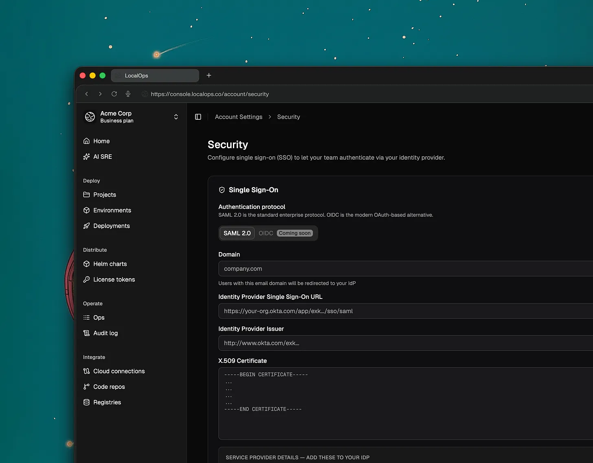
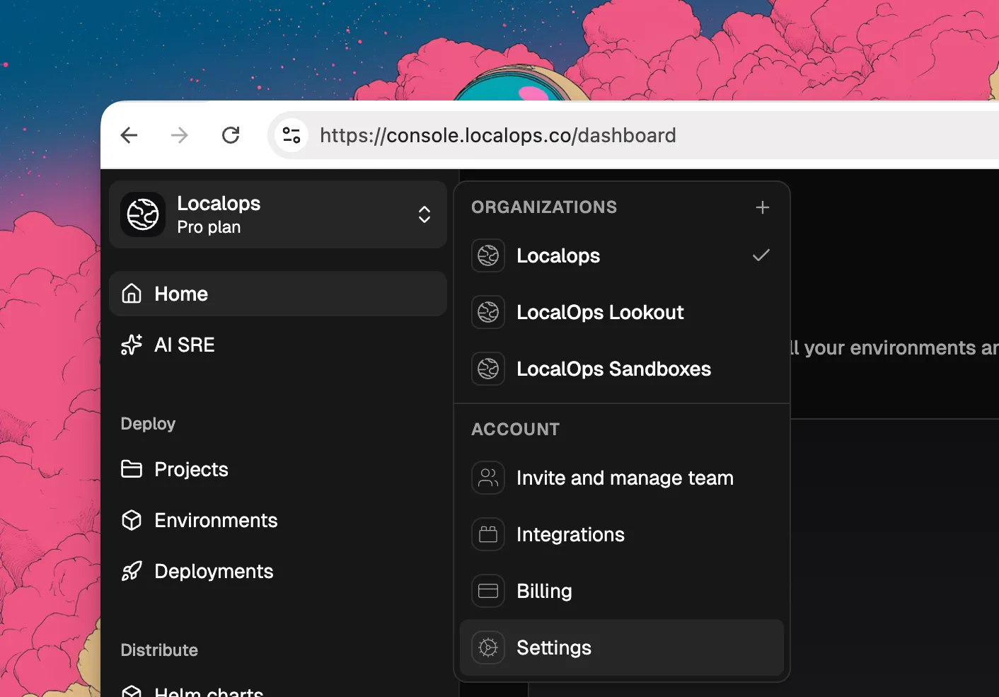
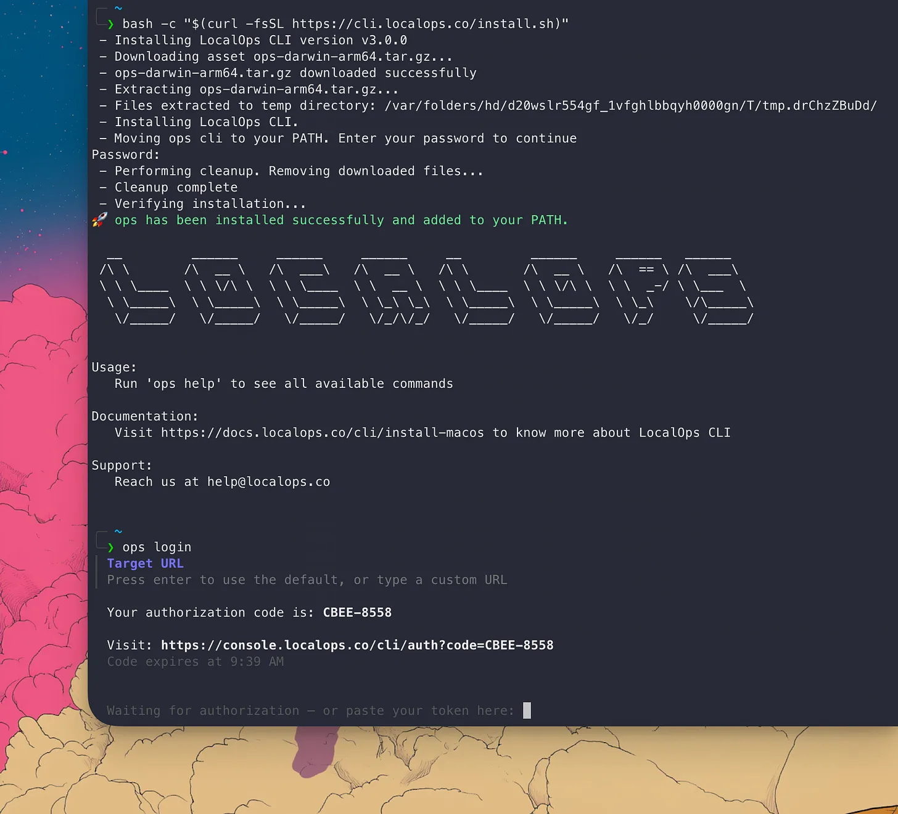
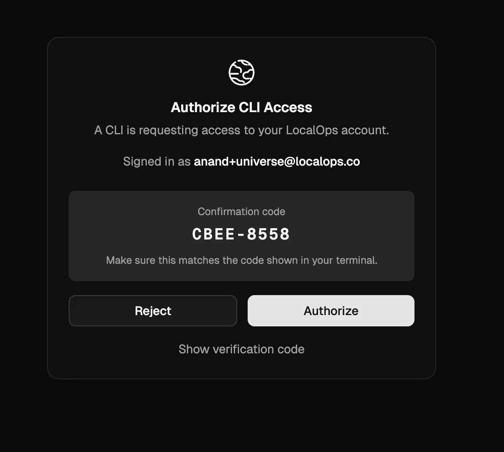
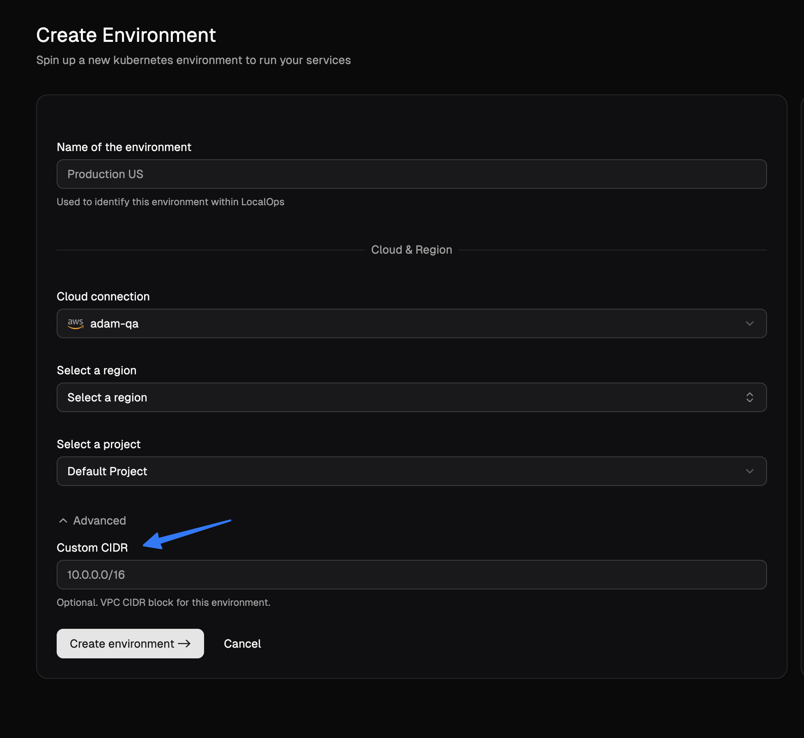
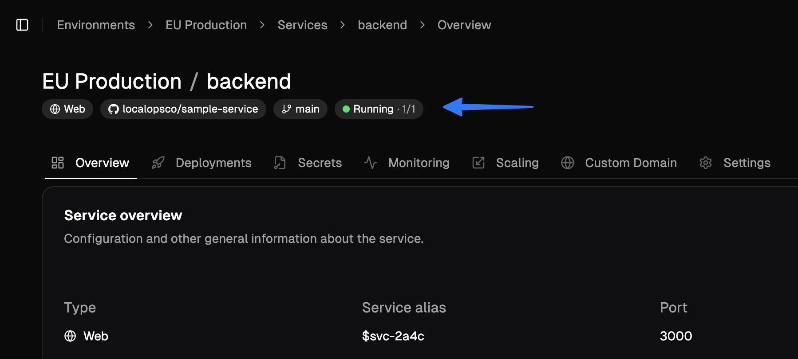
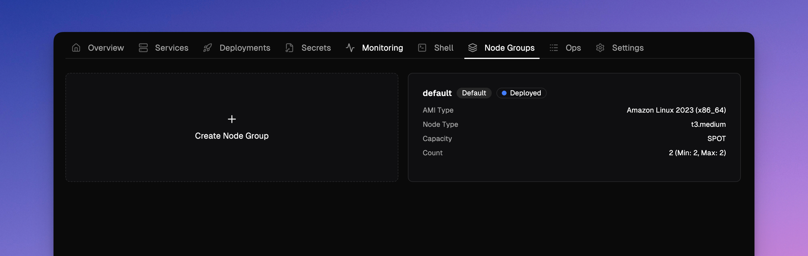

<Update label="May 14, 2026">

## SSL passthrough

Services can now handle TLS termination themselves instead of letting the environment's nginx ingress decrypt traffic. Set `ssl_passthrough` to `true` in `ops.json` and configure your service's port to `443` so the ingress forwards raw TLS connections directly to your container. Useful for mTLS, custom certificate handling, or any protocol requiring end-to-end TLS. See [SSL passthrough](https://docs.localops.co/environment/services/ops-json#ssl-passthrough) for details.

```json
{
  "ssl_passthrough": true
}
```

</Update>

<Update label="May 13, 2026">

## Instrument services with internal /metrics endpoint

You can record custom metrics and expose them to in-built prometheus monitoring stack via `/metrics` endpoint. Just add an ops.json file in your repository and declare "metrics" configuration as documented here - [Instrument services](https://docs.localops.co/environment/services/instrument-service) to get started.

```
{
    "metrics": {
        "endpoint": "/metrics",
        "interval": 15,
        "port": 9090
    }
}
```

This can include:
- language run time metrics - NodeJS event loop metrics, JVM metrics, etc.,
- connection and request metrics like "tcp_connections_open"
- business metrics like "number_of_payments"
- transactional metrics like "number_of_emails_sent"

<Note>Pro tip - Checkout the language specific guides to learn how you can unveil advanced metrics & dashaboards in just few mins of setup (eg: [See this Java guide](https://docs.localops.co/environment/services/instrument/java))</Note>

## Request timeouts 

Set timeouts for TCP connections or requests handled by your services. Default timeout 60s may not be suitable for realtime applications with long running connections. Start declaring custom timeout values in ops.json as specificed in developer docs - [Request timeouts](https://docs.localops.co/environment/services/ops-json#request-timeouts).

### Private IPs passed as environment vars 

`POD_IP` and `HOST_IP` are now injected in each service as environment variables. So if your application requires its own IP address, you can fetch and utilize in your business logic. 

Learn more about [built-in environment vars](https://docs.localops.co/environment/services/secrets#built-in-secrets) like these.

### Other UI enhancements and fixes
1. Saving secrets triggers a "Write secrets" op to keep track of secret updates
2. While creating new service, search for repositories using the new search bar in the repository picker 
3. Bug fixes in Member invite workflow 
4. Bug fixes in preview environments
5. Other fixes in slack and ms teams notificaitons 

</Update>

<Update label="April 18, 2026">

## Projects revampled

We have revamped Projects. You can now create projects and organize environments in them. 

### Members

Projects can have members. Unless an org member is also added as a project member, they can't see the project's environments or deploy to them.

### Revampled navigation bar

Sidebar navigation menu is revamped to make it easy to switcher between organization and projects. 

Other bug fixes and UI enhancements were made too.

</Update>

<Update label="April 9, 2026">

## Organization SSO (SAML 2.0)

We’ve introduced Single Sign-On (SSO) via SAML 2.0, allowing teams to manage access through their preferred identity
providers. This feature simplifies user onboarding and enhances security by centralizing authentication.



Any SAML2.0 compliant identity provider is supported through this SAML2.0.

- Okta
- Microsoft Entra ID
- Google Workspace SSO
- OneLogin
- Auth0

**Availability: Now available for all Business Plan customers**

> What’s Next: OIDC (OpenID Connect) support is currently in development and will be released soon.

#### Improved CLI Organization Management

Users who belong to multiple organizations can now explicitly select their active organization directly within the
Command Line Interface (CLI). This ensures that commands and deployments are always targeted at the correct environment
without manual configuration overrides.

#### Simplified Manual Deployments

To streamline the redeployment process, we’ve added a new option in the manual deployment section. You can now quickly
select and use the last successfully deployed Docker or Helm images, reducing the risk of version mismatch during quick
fixes or rollbacks.

#### Security Improvements

We’ve strengthened the security of our OAuth device authorization flow to further using stricter state validation and
session integrity.

</Update>

<Update label="March 31, 2026">
## Switch organizations/teams & New CLI update

If you run multiple products and multiple engineering teams handling their own qa, uat and production environments, you
will love this update.

**Switch organizations:**

Users can now belong to multiple organizations using their same login / email address. And they can easily switch
between the organizations from the top left menu like this:



Each organization can have unique environments like this:

- Github org
- ECR Registries
- Environments
  - qa
  - uat
  - production
- Deployments

**Enhanced CLI Login:**

LocalOps CLI now use [device auth](https://datatracker.ietf.org/doc/html/rfc8628) for more seamless and secure login. To
login, just type this in your terminal:

```bash
ops login
```



And you will get a link to click and open the browser. If you’re already logged in to LocalOps console
(console.localops.co), we will show up the authorization form that CLI is requesting to use your current login. Once you
authorize, boom! You can access LocalOps services via CLI



You will need to update the CLI version to v3.0.0 to get this update. Checkout [cli](/cli) docs for installing the
correct CLI for your OS.

</Update>

<Update label="March 6, 2026">

## Custom CIDRs for environments

While creating new environments, you can now specify custom CIDR block for your environments. This will be used to
create VPCs and subnets in your cloud accounts and will give more control over your network configurations.

In the Create environment page, you can click on "Advanced options" to see the new field for custom CIDR block. You can
specify any valid CIDR block that you want for your environment.



</Update>

<Update label="March 3, 2026">

## Realtime run status of services

We released a major new enhancement to services today. You can now see the realtime status of all services running
within each environment, without having to use LocalOps CLI or Kubectl CLI.



Depending on the service type, status text will be different. Here are the possible status texts:

For example, for `web`, `internal` services and `worker` services, you will see the following statuses:

- running (2/2)
- degraded (1/2)
- failing (0/2)
- stopped

(x/y) format shows the number of replicas running (x) out of total number of replicas (y).

For job services:

- pending
- succeeded
- failed
- timeout

For cronjob services:

- idle
- active
- suspended

You can see them in service tile view or within service section at the top of the page.

### New "Runs" tab

Lookout for the new "Runs" tab for job and cronjob services. You can see the run history and status of each run.

We update statuses in near real time so you would know when you service is failing, just by looking at the status text
in LocalOps console.

All of these changes were made to make it easier for you to monitor and manage your services, without having to drop
into shell or CLI.

</Update>

<Update label="Feb 27, 2026">

## New feature: Custom Node groups

So far, environments have been having a single node group created, to run all the services.

Now, you can create multiple node groups to run different types of services. For each node group you can pick

1. AMIs
2. Instance types
3. Desired count of nodes



Go to the new Node groups section to create and manage node groups.

You can now create

1. Windows node groups to run windows based services (or)
2. Linux node groups to run linux base services

And while creating a service or updating a service, you can assign it to any one of the node groups. And all its
replicas or containers will run in configured nodes.

## Spot instances

In the case of AWS evnironments, while creating node groups, you can pick between ON_DEMAND or SPOT as capacity types.

So you can create node groups of SPOT instance type and assign interruptible and idempotent services like jobs, crons,
batch processing, or other. This will end up giving up to 50% savings in compute costs.

</Update>

<Update label="Feb 9, 2026">

## New feature: Deployment notes

While triggering new deployments, you can now pass a note text to it. And it will communicate to rest of the team about
what the deployment is all about.

We made other QoS updates here to ensure smooth execution of deployment pipelines.

</Update>

<Update label="Feb 7, 2026">

## New feature: Account level resource tags

All cloud resources of all environments spinned by LocalOps are attached with two standard tags. One with ID of the
environment and another with name of the environment. These tags can be used in Cost explorer to analyse costs at a
granular level.

We released a new feature today to accept custom tags so that you can assign your own key value pairs as tags for all
resources spinned up in all environments of the account. You can use it to attach tags like:

1. `bu: internal`
2. `bu: product-1`
3. `project: project-name`

Go to Account settings > Resource tags to start adding custom tags.

</Update>

<Update label="Jan 13, 2026">

## Bring your own registry

LocalOps can now use your images from your own docker registry to deploy services in your environments. Go to the new
Registries section to add any private docker registry.

We support ECR & DockerHub as of today and plan to support other providers in the coming weeks.

1. Amazon Elastic Container Registry (ECR)
2. DockerHub
3. Google container registry
4. Azure container registry
5. Github packages

([Talk to us](mailto:anand@localops.co) if you need us to support any other registry).

## Bring your code pipeline

### Deploy using LocalOps API

You can run your exisitng code build pipelines to build code and finally call LocalOps API to deploy the code to your
environment. Checkout the API reference for the new /deploy api
[here](https://docs.localops.co/api-reference/deploy-service).

Eg.,

```bash
curl --request POST \
  --url https://sdk.localops.co/v1/environments/{envId}/services/{serviceId}/deploy \
  --header 'Authorization: Bearer <token>' \
  --header 'Content-Type: application/json' \
  --data '
{
  "docker_image_tag": "a1b2c3d4"
}
'
```

### 🍦 Deploy using LocalOps Github action

To cut work, you can also embed our Github action step directly within your `.github/workflows/deploy.yml` to trigger
new deployments.

Like:

```yaml
- use: localopsco/deploy-action
  with:
    - service: auf-d0923-8rljks-fd9o8
    - environment: afdsfk-j092309-4laskd-jf32
    - token: aslkjadsf-dkjfie-uriw-skjf-19823r
    - docker_image_tag: 1.2.2
```

You can pass `docker_image_tag` or `commit_id` or `helm_chart_version` to the action to trigger new deployments.

or with commit sha like:

```yaml
- use: localopsco/deploy-action
  with:
    - service: auf-d0923-8rljks-fd9o8
    - environment: afdsfk-j092309-4laskd-jf32
    - token: aslkjadsf-dkjfie-uriw-skjf-19823r
    - commit_id: akf9a0sd98
```

## Pass ops.json as configuration

For Docker-image based services, you can now add ops.json as configuration to the service settings within LocalOps
console. This will work as documented in ops.json configuration
[here](https://docs.localops.co/environment/services/ops-json).

</Update>

For the previous year, check out [2025](/changelogs/2025)

[demo]: https://go.localops.co/tour
[signup]: https://console.localops.co/signup
