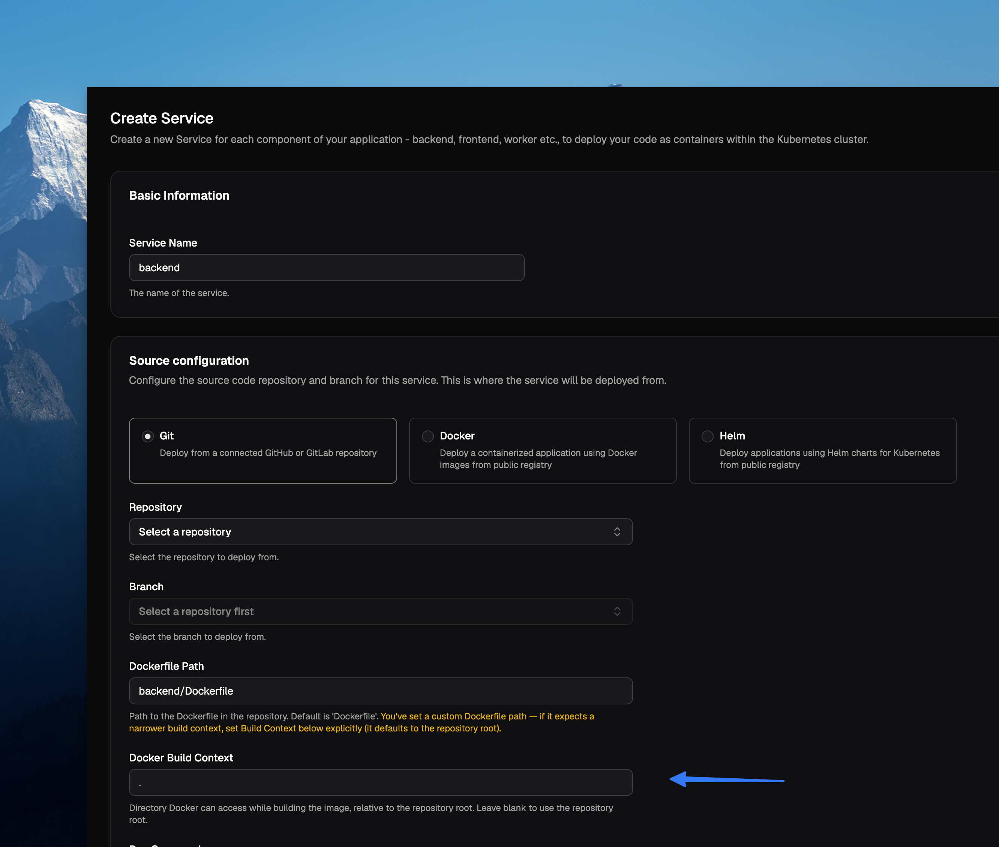
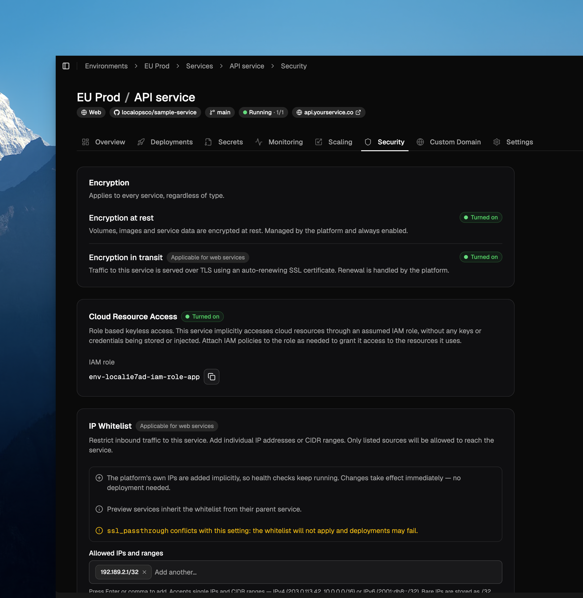
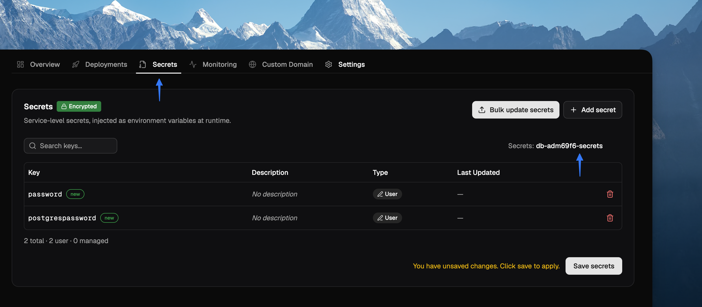
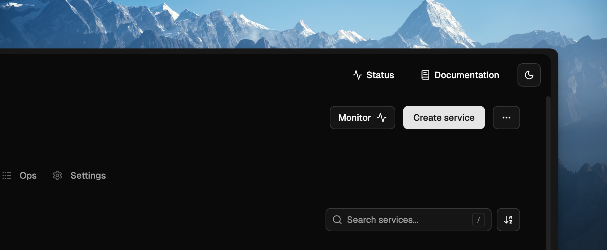
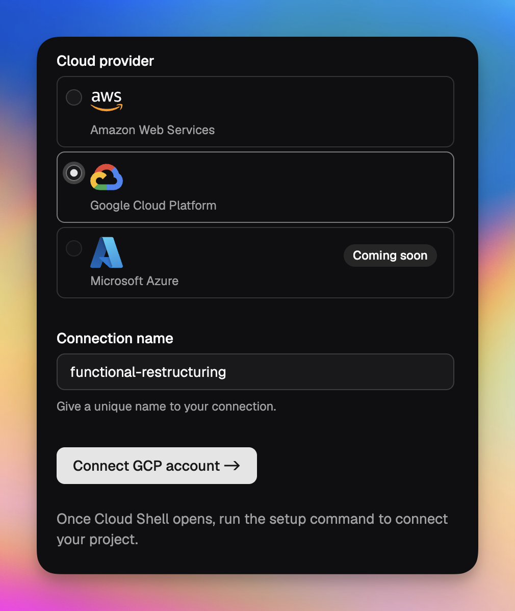
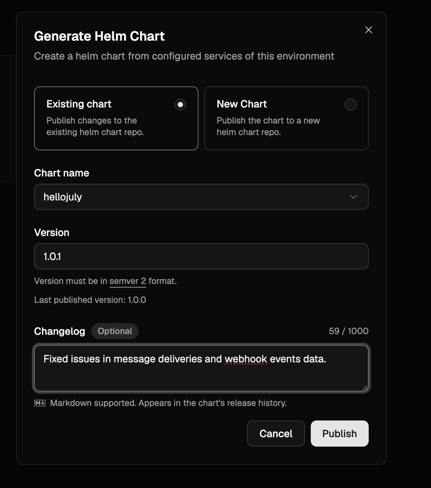
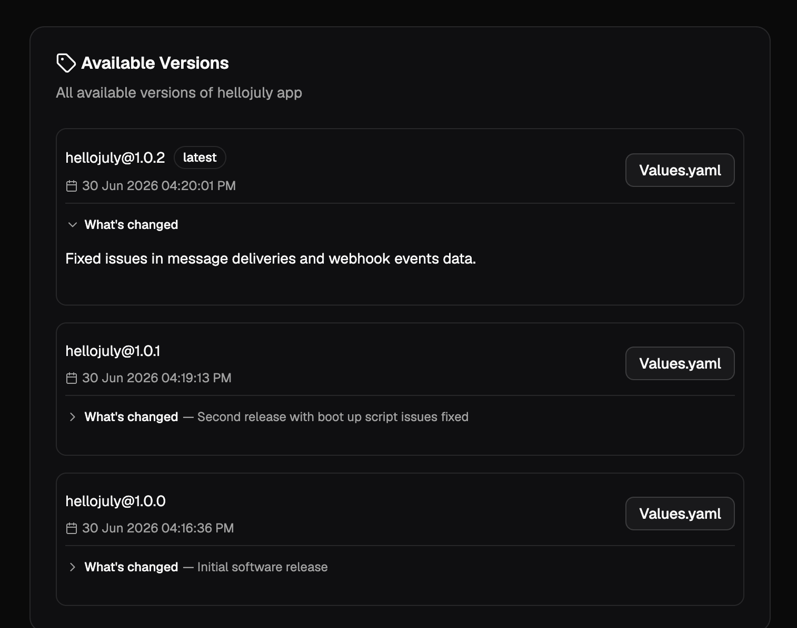
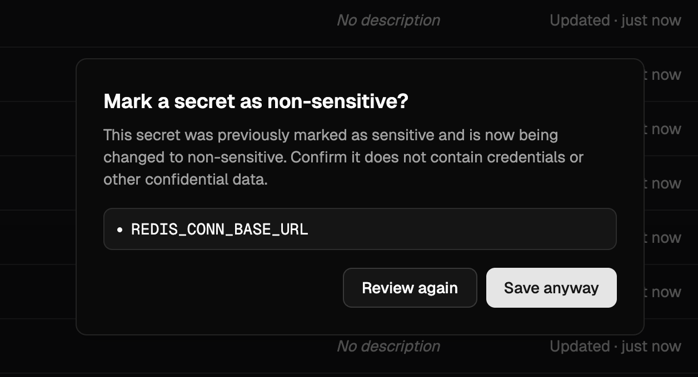
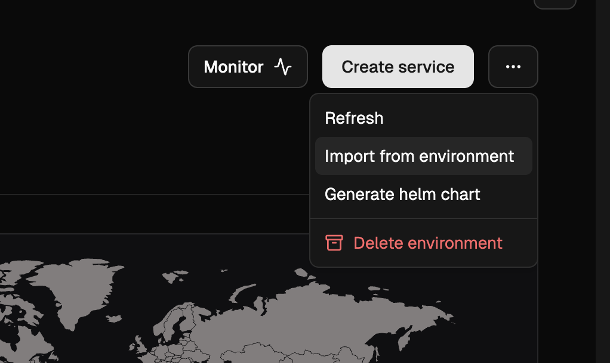

<Update label="September 2, 2026">

## Monorepos fully supported with custom Build Context path



In favor of simplicity, teams host all their code within a single git repository. And organize subsystems within multiple sub-directories like client/, server/, ui/ etc., each having their own Dockerifle.

So far, you can give a custom Dockerfile path while creating services - like client/Dockerfile, server/Dockerfile and so on. 

From today, you can also set a custom build context path to inform our plaform where to trigger `docker build` from. Either from the root of the git repo (default option), or from any other path.

```
docker build -f <DockerfilePath> -t ImageName:ImageTag <BuildContextPath>
```

## EKS control plane logs visible within Grafana

EKS clusters managed via LocalOps platform will now start to log all its control plane logs to CloudWatch which are in turn visible in the in-built grafana dashboard.

So your advanced users get to understand how the underlying cluster works, whenever needed.

### Other enhancements:
1. Increased project description length to let teams describe their projects in full 
2. Several security enhancements to zero out CVEs the 3rd party docker images

Questions? Email us at support@localops.co or ping us in your Slack Connect support channel.

</Update>

<Update label="August 28, 2026">

## Persist data, mount certs, and grab scratch space

Your service may need scratch space for temporary files, a durable disk that survives restarts, or certificate files
mounted at a well known path. Declare all three as volumes in `ops.json` and LocalOps mounts them for you:

```json
{
  "volumes": [
    { "name": "scratch", "mount_path": "/tmp/scratch", "kind": "mem", "size": "512Mi" },
    { "name": "data", "mount_path": "/var/lib/data", "kind": "disk", "size": "10Gi", "expose": true },
    { "name": "certs", "mount_path": "/etc/certs", "kind": "secret", "secret_name": "my-tls-certs" }
  ]
}
```

`mem` is scratch discarded at shutdown — add a `size` to make it a RAM disk. `disk` is encrypted, persists across
restarts and gets one disk per replica. `secret` mounts a Kubernetes secret read-only, each key becoming a file. Disk
volumes aren't available on cron and job services, and support covers AWS and GCP.

The same declaration drives the Helm chart you generate for customers. Volumes marked `expose: true` land in the
chart's `values.yaml` under `persistence`, so whoever installs it can size the disk or point at their own secret:

```yaml
api:
  persistence:
    # /var/lib/data
    'data':
      size: 10Gi
```

Everything else stays fixed — mount paths and kinds are part of how your app works, not an install-time choice.
[Read the docs](/environment/services/ops-json#volumes).

## Let your Elixir nodes find each other

Phoenix PubSub, a distributed registry, or any coordinated work across replicas needs your BEAM nodes to discover each
other first. Add one field to `ops.json`, using the same value in every service that belongs together:

```json
{
  "beam_cluster_id": "myapp"
}
```

Each service gets `LOPS_BEAM_CLUSTER_NAME` and `LOPS_BEAM_CLUSTER_DNS` injected at runtime — point libcluster's
Kubernetes DNS strategy at the latter, and set `RELEASE_DISTRIBUTION`, `RELEASE_NODE` and `RELEASE_COOKIE` yourself.
Rebuild to apply, and note that previews cluster separately from production.
[Read the docs](/environment/services/beam-clustering).

## Run VMs inside your services on GCP

Firecracker microVMs, Android emulators, CI runners that build and boot disk images — workloads that need a real VM
couldn't run on LocalOps before, because the underlying nodes didn't permit a guest hypervisor.

Now you can enable nested virtualization on a GCP node group from the Node groups section, picking an Intel-based
machine type, then assign the services that need VMs to it. KVM is available inside the container, so anything
shelling out to QEMU/KVM behaves as it would on a bare VM.

Questions? Email us at support@localops.co or ping us in your Slack Connect support channel.

</Update>

<Update label="August 20, 2026">

## Restrict who can reach your services with IP allowlists



Some of your services shouldn't be open to the whole internet. An internal admin panel, a partner-facing API, a
staging web app — you want these reachable only from your office network, your VPN, or a specific customer's egress
IPs.

There's now a **Security** tab in the service dashboard where you can do exactly that.

Add the IP addresses and CIDR ranges that should be allowed to reach the service, and everything else gets turned away
at the ingress:

```
203.0.113.0/24
198.51.100.7
10.20.0.0/16
```

Leave the list empty and the service stays open to all IPs — which is how every service behaves today, so nothing
changes until you explicitly add entries.

### Preview services and cloned environments

Preview services inherit the allowlist from their parent service automatically, so a locked-down service stays locked
down across its previews. Cloning an environment also copies each service's allowlist to the clone. Neither needs
anything from you.

Questions? Email us at support@localops.co or ping us in your Slack Connect support channel.

</Update>

<Update label="August 12, 2026">

## Passing secrets securely for Helm Charts

Secrets section is now available for Helm Chart services too! 



So teams can now create secrets for Helm charts in the secrets editor. This will encrypt and save secrets in AWS parameter store (in the case of AWS) and save them as secret in Kubernetes cluster.

And in values.yaml passed as setting in Helm chart service, the k8s secret can be referenced. Like this, for example with postgers chart: 

  ```yaml
  auth:
    existingSecret: "db-adm69f6-secrets"
    secretKeys:
      adminPasswordKey: "postgrespassword"
      userPasswordKey: "password"
````

  You can find the `existingSecret` name in secrets section.


...instead of passing them in plaintext like this: 

  ```yaml
  auth:
    postgresPassword: "mysecretpass"
    username: "myuser"
    password: "myuserpass"
    database: "mydb"
  ````


### Custom domain for chart services 

Say your helm chart exposes services to the public world. For eg - you're self-hosting Supabase which has a dashboard that must be exposed to the world. 

New "Custom domain" section in the service dashboad will now provide instructions on how to expose this service.

Questions? Email us at support@localops.co or ping us in your Slack Connect support channel.

</Update>

<Update label="August 7, 2026">

## New search bar

Managing more than a handful of services in your environment?

Checkout the new search bar in services section that lets you search for services by their name or branch name or anything you remember about them.



### New demo section 

When users sign up for first time, they are greeted a new brand new demo section that takes them live through the core product UX in just 2 mins.

- create environment 
- deploy services 
- repeat! 

Questions? Email us at support@localops.co or ping us in your Slack Connect support channel.

</Update>

<Update label="July 29, 2026">

## Bug fixes

We sent a bunch of fixes this time, as reported by our users:

- Fixed an issue where console refreshes adhoc when picking a repo in service form 
- Hide the replica count when service is stopped and avoid showing "0/0" as count
- Post service creation, showed an appropriate message to ask user to deploy with correct branch name
- Allowed user to picker large cpu and memory rquirements for their service(s) under Scaling tab
- Several other minor bug fixes and UI refinements throughout the console

Questions? Email us at support@localops.co or ping us in your Slack Connect support channel.

</Update>

<Update label="July 28, 2026">

## Environment cloning fixes

A few fixes to make cloning an environment more reliable:

- **Clone environments across projects.** You can now clone an environment into a different project, not just within the same project — handy for promoting a setup from one project to another.
- **More reliable global secrets page.** The global secrets page in a cloned environment now loads consistently on the first try instead of occasionally appearing empty, and the page stays safely locked until your secrets have fully loaded.
- **Service references in `ops.json` are now rewritten correctly.** When you clone an environment, service alias references (e.g. `$svc-123`) in `ops.json` are updated to point at the corresponding services in the new environment — matching how secrets are already remapped.
- **Helm charts are no longer skipped.** Helm-based services are now reliably included when cloning an environment, instead of occasionally being left out.

Questions? Email us at support@localops.co or ping us in your Slack Connect support channel.

</Update>

<Update label="July 17, 2026">

## Lots of little fixes (and some tighter access control)

Team and account management endpoints now enforce **owner/admin roles**. Inviting or removing members, cancelling invitations, changing member roles, listing members and invitations, managing API tokens, registry and license-token access, and account domain changes are all now restricted to owners and admins. Members without the right role receive a clear permission error instead of the action going through.

## Clearer error messages

- Domain verification failures now return a specific `DOMAIN_VERIFICATION_FAILED` error instead of a generic 4xx, so you can tell exactly what went wrong.
- Verbose internal authentication validation errors are no longer surfaced in API responses, keeping error output clean and actionable.

## Fixes

- Environment creation could sometimes fail in fresh Google Cloud projects — this has been fixed.
- Private instance lookups and updates are more robust — consistent handling of not-found instances and a fix for an edge case when updating an instance with no changed fields.
- Fixed the LocalOps CLI rendering CLI flags: the Geist Mono ligature no longer swallows the space before double-dash (`--`) flags.

No new buttons to click this week — just a bunch of things that quietly stopped misbehaving. Your future self, running `deploy` at 2am, thanks us.

Questions? Email us at support@localops.co or ping us in your Slack Connect support channel.

</Update>

<Update label="July 3, 2026">

## Google Cloud support



You can now spin up environments and deploy services on **Google Cloud** — just the way it works on AWS. The underlying cloud specifics are abstracted out, so your teams get the same developer experience regardless of whether they run on Google Cloud or AWS.

To get started, add a new connection, pick **Google Cloud**, and follow the setup flow. See [Connect a Google Cloud account](https://docs.localops.co/accounts/gcp) for the full walkthrough.

If you don't see Google Cloud as an option, write to us at support@localops.co to get access.

## Update the CLI to v3.0.3

To use Google Cloud support, update the LocalOps CLI to **v3.0.3**. See the [CLI install guide](https://docs.localops.co/cli/usage) for how to update.

Questions? Email us at support@localops.co or ping us in your Slack Connect support channel.

</Update>

<Update label="June 30, 2026">

## GitLab support

You can now connect your GitLab repositories to LocalOps and enable continuous deployments on any cloud — your own cloud or your customer's cloud. Once connected, every push triggers a deployment through the same pipeline you already use, so GitLab-hosted teams get the full BYOC, single-tenant and self-hosted experience without changing where their code lives.

## Changelog for each Helm chart version

When generating a Helm chart, you can now add a changelog describing what changed in that version. The changelog is optional, supports Markdown, and appears in the chart's release history — so the teams installing your chart can see exactly what each version brings.



The changelog shows up against every version under **Available Versions**, with a short summary and the full text expandable inline.



Questions about either feature? Email us at support@localops.co or ping us in your Slack Connect support channel.

</Update>

<Update label="June 16, 2026">

## Reading the real client IP

New doc explaining which header to trust for the real client IP based on how your service is fronted. The short version:

| Setup                                           | Read this header                                                      |
| ----------------------------------------------- | --------------------------------------------------------------------- |
| No CDN, HTTP                                    | `X-Real-IP` (or `X-Forwarded-For`)                                    |
| No CDN, HTTPS (via SSL-passthrough multiplexer) | `X-Real-IP` (or `X-Forwarded-For`)                                    |
| Behind CDN                                      | `X-Forwarded-For[0]` — or the CDN's own header like `CF-Connecting-IP` / `True-Client-IP` |

See [Client IP](https://docs.localops.co/environment/services/client-ip) for the full guidance, spoofing notes, and Node / Python / Go / Elixir examples.

</Update>

<Update label="June 12, 2026">

## New warning when marking a Helm chart field as non-sensitive

When editing a Helm chart's values in the console, switching a previously sensitive field to non-sensitive now prompts a confirmation dialog listing every affected key. This guards against accidentally exposing credentials or other confidential data — once a value is marked non-sensitive, it is stored and rendered in plain text.



</Update>

<Update label="June 9, 2026">

## `DEPLOYMENT_ID` and `LOPS_INSTANCE_ID` built-in secrets

Every service now receives `DEPLOYMENT_ID` and `LOPS_INSTANCE_ID` as built-in environment variables. Both carry the same 24-character alphanumeric value (as unique as a UUIDv4) — unique per LocalOps-managed environment, and unique per Helm install of charts generated by LocalOps. Use either to tag logs, metrics or external resources with the originating environment.

See [Built-in secrets](https://docs.localops.co/environment/services/secrets#built-in-secrets) for the full list.

</Update>

<Update label="June 5, 2026">

## Import environment

You can now create a new environment from one or more existing environments in just a few clicks via **Import environment**. In a brand new environment, click the 3-dots on the top right and choose "Import from environment". Pick a source environment and import — all services, secrets and cloud resources (RDS, ElastiCache, S3, etc.) are copied over, with inter-dependencies preserved, so you can start deploying as soon as the import finishes.



</Update>

<Update label="June 2, 2026">

## `managed_password` toggle for RDS

RDS instances in `ops.json` now accept a `managed_password` boolean. The default is `true`, where AWS RDS generates the master password, stores it in its own AWS Secrets Manager entry, and rotates it automatically. Setting it to `false` makes LocalOps generate a cryptographically unique string and use it as the RDS master password instead — the password is then not rotated, so this mode is not recommended. Regardless of which mode you pick, use `$password` and `$dsn` in `exports` to fetch the current password and connection string; LocalOps resolves them transparently in both cases.

```json
{
  "dependencies": {
    "rds": {
      "instances": [
        {
          "id": "test123",
          "prefix": "testdep123",
          "engine": "postgres",
          "managed_password": true,
          "exports": {
            "MY_RDS_INSTANCE_PASSWORD": "$password",
            "MY_RDS_INSTANCE_DSN": "$dsn"
          }
        }
      ]
    }
  }
}
```

See [RDS](https://docs.localops.co/environment/services/aws/rds) for details.

</Update>

<Update label="May 28, 2026">

## OpenSearch as a dependency

You can now declare Amazon OpenSearch domains under `dependencies.opensearch.domains` in `ops.json`. LocalOps provisions production-tuned domains by default — 3-node multi-AZ quorum, encryption at rest, node-to-node encryption, HTTPS-only with TLS 1.2, fine-grained access control with an auto-generated master user in AWS Secrets Manager, and audit logging to CloudWatch. Preview environments are automatically scaled down to a single node. See [OpenSearch](https://docs.localops.co/environment/services/aws/opensearch) for the full reference.

```json
{
  "dependencies": {
    "opensearch": {
      "domains": [
        {
          "id": "productsearch",
          "prefix": "product-search",
          "engine_version": "OpenSearch_2.11",
          "instance_type": "t3.small.search",
          "node_count": 3,
          "exports": {
            "PRODUCT_SEARCH_DSN": "$dsn"
          }
        }
      ]
    }
  }
}
```

## `parameters` for RDS and ElastiCache

Both RDS instances and ElastiCache clusters now accept a `parameters` list in `ops.json` to configure DB / cache parameter group settings inline. LocalOps creates a dedicated parameter group for the resource and keeps it in sync as you add, update or remove entries on subsequent deployments.

For RDS, each entry takes a `name`, `value` and an `apply_method` of `immediate` or `pending-reboot` (use the latter for parameters like `shared_preload_libraries` that need a restart):

```json
{
  "parameters": [
    {
      "name": "shared_preload_libraries",
      "value": "pg_stat_statements,pg_cron",
      "apply_method": "pending-reboot"
    }
  ]
}
```

For ElastiCache, each entry is just a `name` and `value`:

```json
{
  "parameters": [
    {
      "name": "maxmemory-policy",
      "value": "volatile-lru"
    }
  ]
}
```

See [RDS](https://docs.localops.co/environment/services/aws/rds) and [ElastiCache](https://docs.localops.co/environment/services/aws/elasti-cache) for details.

## Plaintext `$password` and `$dsn` exports for RDS

RDS exports now include `$password` and `$dsn` alongside the existing `$passwordArn`. `$password` resolves the master user password from AWS Secrets Manager and injects it directly as an environment variable, so your code does not need to call the Secrets Manager API. `$dsn` is a ready-to-use connection string in the form `postgres://$username:$password@$address:5432/$dbName` (or the MySQL equivalent) for libraries that accept a single URL. Treat both values as secrets.

```json
{
  "exports": {
    "MY_RDS_INSTANCE_PASSWORD": "$password",
    "MY_RDS_INSTANCE_DSN": "$dsn"
  }
}
```

## Import managed secrets from other services

Secrets exported via `ops.json` now appear in each service's console secrets section as **managed secrets**. You can pull those exports into any other service in the same environment as a single secret — every key the source service exported is injected as environment variables in the importing service.

This is useful for wiring databases, caches and other declared cloud resources into the services that consume them. For example, a boot script job can declare an RDS instance in `ops.json` and export its DSN, username and password; any other service in the same environment can then import them all in one line. See [Importing other service secrets](https://docs.localops.co/environment/services/secrets#importing-other-service-secrets) for the syntax.

## Search in the service switcher

The service switcher now has a search bar at the top, so you can jump to a service by typing instead of scrolling. Handy in environments with a long list of services.

</Update>

<Update label="May 22, 2026">

## Deletion protection for critical services

You can now turn on **deletion protection** for a service from its settings. Once enabled, the service cannot be deleted until protection is explicitly turned off — a safety net for production and other critical services where an accidental delete could cause downtime.

</Update>

<Update label="May 21, 2026">

## ✋ Improvements and bug fixes

We have shipped a handful of bug fixes and small enhancements today to make day-to-day operations smoother. These are the kind of polish that adds up over time. Read on for the highlights.

#### <Icon icon="square" iconType="solid" color="#dc2626" /> Stop and start services on demand

Each service dashboard now has a **Stop** button in the top right corner. Use it to scale down a service's replica/container count to `0` on demand, without deleting the service or its configuration. Click start button to bring it back up.

#### Consistent image tag on redeploys

After updating secrets or scaling settings, users can trigger a new deployment. For docker image based services, this deployment was previously pulling the image with the `latest` tag. It now uses the exact image tag from the previous deployment, so redeploys stay consistent with what was last running.

</Update>

<Update label="May 19, 2026">

## Valkey support for ElastiCache

ElastiCache clusters declared in `ops.json` can now use `valkey` as the engine, alongside `redis` and `memcache`. Pick a supported version from the [AWS Valkey versions list](https://docs.aws.amazon.com/AmazonElastiCache/latest/dg/supported-engine-versions-valkey.html). See [ElastiCache](https://docs.localops.co/environment/services/aws/elasti-cache) for details.

```json
{
  "dependencies": {
    "elasticache": {
      "clusters": [
        {
          "id": "test123",
          "prefix": "testdep123",
          "engine": "valkey",
          "version": "8.0",
          "instance_type": "cache.t4g.small",
          "num_nodes": 1
        }
      ]
    }
  }
}
```

</Update>

<Update label="May 14, 2026">

## SSL passthrough

Services can now handle TLS termination themselves instead of letting the environment's nginx ingress decrypt traffic. Set `ssl_passthrough` to `true` in `ops.json` and configure your service's port to `443` so the ingress forwards raw TLS connections directly to your container. Useful for mTLS, custom certificate handling, or any protocol requiring end-to-end TLS. See [SSL passthrough](https://docs.localops.co/environment/services/ops-json#ssl-passthrough) for details.

```json
{
  "ssl_passthrough": true
}
```

</Update>

<Update label="May 13, 2026">

## Instrument services with internal /metrics endpoint

You can record custom metrics and expose them to in-built prometheus monitoring stack via `/metrics` endpoint. Just add an ops.json file in your repository and declare "metrics" configuration as documented here - [Instrument services](https://docs.localops.co/environment/services/instrument-service) to get started.

```
{
    "metrics": {
        "endpoint": "/metrics",
        "interval": 15,
        "port": 9090
    }
}
```

This can include:
- language run time metrics - NodeJS event loop metrics, JVM metrics, etc.,
- connection and request metrics like "tcp_connections_open"
- business metrics like "number_of_payments"
- transactional metrics like "number_of_emails_sent"

<Note>Pro tip - Checkout the language specific guides to learn how you can unveil advanced metrics & dashaboards in just few mins of setup (eg: [See this Java guide](https://docs.localops.co/environment/services/instrument/java))</Note>

## Request timeouts 

Set timeouts for TCP connections or requests handled by your services. Default timeout 60s may not be suitable for realtime applications with long running connections. Start declaring custom timeout values in ops.json as specificed in developer docs - [Request timeouts](https://docs.localops.co/environment/services/ops-json#request-timeouts).

### Private IPs passed as environment vars 

`POD_IP` and `HOST_IP` are now injected in each service as environment variables. So if your application requires its own IP address, you can fetch and utilize in your business logic. 

Learn more about [built-in environment vars](https://docs.localops.co/environment/services/secrets#built-in-secrets) like these.

### Other UI enhancements and fixes
1. Saving secrets triggers a "Write secrets" op to keep track of secret updates
2. While creating new service, search for repositories using the new search bar in the repository picker 
3. Bug fixes in Member invite workflow 
4. Bug fixes in preview environments
5. Other fixes in slack and ms teams notificaitons 

</Update>

<Update label="April 18, 2026">

## Projects revampled

We have revamped Projects. You can now create projects and organize environments in them. 

### Members

Projects can have members. Unless an org member is also added as a project member, they can't see the project's environments or deploy to them.

### Revampled navigation bar

Sidebar navigation menu is revamped to make it easy to switcher between organization and projects. 

Other bug fixes and UI enhancements were made too.

</Update>

<Update label="April 9, 2026">

## Organization SSO (SAML 2.0)

We’ve introduced Single Sign-On (SSO) via SAML 2.0, allowing teams to manage access through their preferred identity
providers. This feature simplifies user onboarding and enhances security by centralizing authentication.


Any SAML2.0 compliant identity provider is supported through this SAML2.0.

- Okta
- Microsoft Entra ID
- Google Workspace SSO
- OneLogin
- Auth0

**Availability: Now available for all Business Plan customers**

> What’s Next: OIDC (OpenID Connect) support is currently in development and will be released soon.

#### Improved CLI Organization Management

Users who belong to multiple organizations can now explicitly select their active organization directly within the
Command Line Interface (CLI). This ensures that commands and deployments are always targeted at the correct environment
without manual configuration overrides.

#### Simplified Manual Deployments

To streamline the redeployment process, we’ve added a new option in the manual deployment section. You can now quickly
select and use the last successfully deployed Docker or Helm images, reducing the risk of version mismatch during quick
fixes or rollbacks.

#### Security Improvements

We’ve strengthened the security of our OAuth device authorization flow to further using stricter state validation and
session integrity.

</Update>

<Update label="March 31, 2026">
## Switch organizations/teams & New CLI update

If you run multiple products and multiple engineering teams handling their own qa, uat and production environments, you
will love this update.

**Switch organizations:**

Users can now belong to multiple organizations using their same login / email address. And they can easily switch
between the organizations from the top left menu like this:


Each organization can have unique environments like this:

- Github org
- ECR Registries
- Environments
  - qa
  - uat
  - production
- Deployments

**Enhanced CLI Login:**

LocalOps CLI now use [device auth](https://datatracker.ietf.org/doc/html/rfc8628) for more seamless and secure login. To
login, just type this in your terminal:

```bash
ops login
```


And you will get a link to click and open the browser. If you’re already logged in to LocalOps console
(console.localops.co), we will show up the authorization form that CLI is requesting to use your current login. Once you
authorize, boom! You can access LocalOps services via CLI


You will need to update the CLI version to v3.0.0 to get this update. Checkout [cli](/cli) docs for installing the
correct CLI for your OS.

</Update>

<Update label="March 6, 2026">

## Custom CIDRs for environments

While creating new environments, you can now specify custom CIDR block for your environments. This will be used to
create VPCs and subnets in your cloud accounts and will give more control over your network configurations.

In the Create environment page, you can click on "Advanced options" to see the new field for custom CIDR block. You can
specify any valid CIDR block that you want for your environment.


</Update>

<Update label="March 3, 2026">

## Realtime run status of services

We released a major new enhancement to services today. You can now see the realtime status of all services running
within each environment, without having to use LocalOps CLI or Kubectl CLI.


Depending on the service type, status text will be different. Here are the possible status texts:

For example, for `web`, `internal` services and `worker` services, you will see the following statuses:

- running (2/2)
- degraded (1/2)
- failing (0/2)
- stopped

(x/y) format shows the number of replicas running (x) out of total number of replicas (y).

For job services:

- pending
- succeeded
- failed
- timeout

For cronjob services:

- idle
- active
- suspended

You can see them in service tile view or within service section at the top of the page.

### New "Runs" tab

Lookout for the new "Runs" tab for job and cronjob services. You can see the run history and status of each run.

We update statuses in near real time so you would know when you service is failing, just by looking at the status text
in LocalOps console.

All of these changes were made to make it easier for you to monitor and manage your services, without having to drop
into shell or CLI.

</Update>

<Update label="Feb 27, 2026">

## New feature: Custom Node groups

So far, environments have been having a single node group created, to run all the services.

Now, you can create multiple node groups to run different types of services. For each node group you can pick

1. AMIs
2. Instance types
3. Desired count of nodes


Go to the new Node groups section to create and manage node groups.

You can now create

1. Windows node groups to run windows based services (or)
2. Linux node groups to run linux base services

And while creating a service or updating a service, you can assign it to any one of the node groups. And all its
replicas or containers will run in configured nodes.

## Spot instances

In the case of AWS evnironments, while creating node groups, you can pick between ON_DEMAND or SPOT as capacity types.

So you can create node groups of SPOT instance type and assign interruptible and idempotent services like jobs, crons,
batch processing, or other. This will end up giving up to 50% savings in compute costs.

</Update>

<Update label="Feb 9, 2026">

## New feature: Deployment notes

While triggering new deployments, you can now pass a note text to it. And it will communicate to rest of the team about
what the deployment is all about.

We made other QoS updates here to ensure smooth execution of deployment pipelines.

</Update>

<Update label="Feb 7, 2026">

## New feature: Account level resource tags

All cloud resources of all environments spinned by LocalOps are attached with two standard tags. One with ID of the
environment and another with name of the environment. These tags can be used in Cost explorer to analyse costs at a
granular level.

We released a new feature today to accept custom tags so that you can assign your own key value pairs as tags for all
resources spinned up in all environments of the account. You can use it to attach tags like:

1. `bu: internal`
2. `bu: product-1`
3. `project: project-name`

Go to Account settings > Resource tags to start adding custom tags.

</Update>

<Update label="Jan 13, 2026">

## Bring your own registry

LocalOps can now use your images from your own docker registry to deploy services in your environments. Go to the new
Registries section to add any private docker registry.

We support ECR & DockerHub as of today and plan to support other providers in the coming weeks.

1. Amazon Elastic Container Registry (ECR)
2. DockerHub
3. Google container registry
4. Azure container registry
5. Github packages

([Talk to us](mailto:anand@localops.co) if you need us to support any other registry).

## Bring your code pipeline

### Deploy using LocalOps API

You can run your exisitng code build pipelines to build code and finally call LocalOps API to deploy the code to your
environment. Checkout the API reference for the new /deploy api
[here](https://docs.localops.co/api-reference/deploy-service).

Eg.,

```bash
curl --request POST \
  --url https://sdk.localops.co/v1/environments/{envId}/services/{serviceId}/deploy \
  --header 'Authorization: Bearer <token>' \
  --header 'Content-Type: application/json' \
  --data '
{
  "docker_image_tag": "a1b2c3d4"
}
'
```

### 🍦 Deploy using LocalOps Github action

To cut work, you can also embed our Github action step directly within your `.github/workflows/deploy.yml` to trigger
new deployments.

Like:

```yaml
- use: localopsco/deploy-action
  with:
    - service: auf-d0923-8rljks-fd9o8
    - environment: afdsfk-j092309-4laskd-jf32
    - token: aslkjadsf-dkjfie-uriw-skjf-19823r
    - docker_image_tag: 1.2.2
```

You can pass `docker_image_tag` or `commit_id` or `helm_chart_version` to the action to trigger new deployments.

or with commit sha like:

```yaml
- use: localopsco/deploy-action
  with:
    - service: auf-d0923-8rljks-fd9o8
    - environment: afdsfk-j092309-4laskd-jf32
    - token: aslkjadsf-dkjfie-uriw-skjf-19823r
    - commit_id: akf9a0sd98
```

## Pass ops.json as configuration

For Docker-image based services, you can now add ops.json as configuration to the service settings within LocalOps
console. This will work as documented in ops.json configuration
[here](https://docs.localops.co/environment/services/ops-json).

</Update>

For the previous year, check out [2025](/changelogs/2025)

[demo]: https://go.localops.co/tour
[signup]: https://console.localops.co/signup
