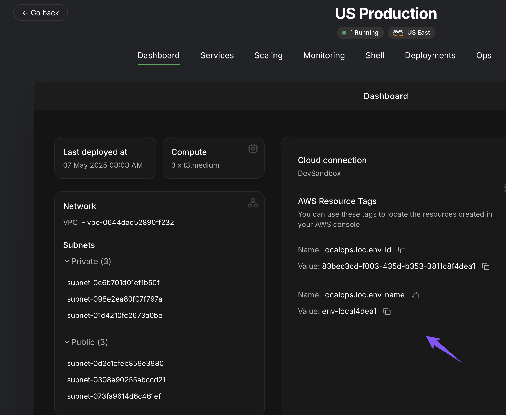

You may want to create additional cloud resources (Queues, Databases, Topics or anything) within a cloud account for any
environment - dev, stage, prod, beyond what LocalOps has provisioned for the same environment.

This guide explains how to extend environments using your Terraform/Pulumi scripts.

At a high level, every environment comes with the following components that are provisioned and managed by LocalOps:

- 1 VPC
- 3 private subnets
- 3 public subnets
- a managed Kubernetes cluster (EKS in AWS)

All your code is deployed and run as sevice(s) in the managed kubernetes cluster.

You can provision additional cloud resources within the same VPC & subnets and they can be accessed from within your
service(s) privately.

To do this, we expose IDs of the above entities within LocalOps environment dashboard:


### Manual

You can create cloud resources manually within the cloud console and use VPC/Subnet IDs in relevant places.

### Automate

Add the VPC/Subnet IDs as variables in your Pulumi/Terraform scripts and automate those cloud resources.

Say you want to create a RDS database for your environment. Here is how you will do it in Terraform, OpenTofu or Pulumi.

### Using Terraform or OpenTofu

Here is how you can create an RDS database within the same private subnets and VPCs of the environment using Terraform
or OpenTofu.

```hcl
variable "vpc_id" {
  description = "The ID of the VPC where RDS will be deployed"
  type        = string
}

variable "subnet_ids" {
  description = "List of private subnet IDs for RDS"
  type        = list(string)
}

resource "aws_db_subnet_group" "rds" {
  name       = "custom-rds-subnet-group"
  subnet_ids = var.subnet_ids

  tags = {
    Name = "custom-rds-subnet-group"
  }
}

resource "aws_security_group" "rds_sg" {
  name        = "rds-sg"
  description = "Security group for RDS"
  vpc_id      = var.vpc_id

  ingress {
    from_port   = 5432
    to_port     = 5432
    protocol    = "tcp"
    cidr_blocks = ["10.0.0.0/16"]
  }

  egress {
    from_port   = 0
    to_port     = 0
    protocol    = "-1"
    cidr_blocks = ["0.0.0.0/0"]
  }

  tags = var.tags
}

resource "aws_db_instance" "main" {
  identifier              = "example-db"
  engine                  = "postgres"
  instance_class          = "db.t3.micro"
  allocated_storage       = 20
  username                = "admin"
  password                = "password123"
  db_subnet_group_name    = aws_db_subnet_group.rds.name
  vpc_security_group_ids  = var.vpc_security_group_ids
  skip_final_snapshot     = true

  tags = {
    Name = "example-db"
  }
}
```

### Using Pulumi

Here is a short example in Typescript, for provisioning a RDS database using Pulumi. Note that we can pass in VPC ID and
subnet IDs as environment variable.

```ts
import * as aws from '@pulumi/aws';

const subnetIds = ['subnet-abc123', 'subnet-def456']; // pass from config

const subnetGroup = new aws.rds.SubnetGroup('exampleSubnetGroup', {
  subnetIds: subnetIds,
});

// Create Security Group for RDS
const rdsSg = new aws.ec2.SecurityGroup('rds-sg', {
  vpcId,
  description: 'Allow Postgres from within VPC',
  ingress: [
    {
      protocol: 'tcp',
      fromPort: 5432,
      toPort: 5432,
      cidrBlocks: ['10.0.0.0/16'],
    },
  ],
  egress: [
    {
      protocol: '-1',
      fromPort: 0,
      toPort: 0,
      cidrBlocks: ['0.0.0.0/0'],
    },
  ],
});

const db = new aws.rds.Instance('exampleDb', {
  engine: 'postgres',
  instanceClass: 'db.t3.micro',
  allocatedStorage: 20,
  username: 'admin',
  password: 'password123',
  dbSubnetGroupName: subnetGroup.name,
  vpcSecurityGroupIds: [rdsSg.id],
  skipFinalSnapshot: true,
});
```

<Info>
  We use `10.0.0.0/16` as CIDR range for any VPC we create. You can use the same as source IP or destination IP range
  when defining security groups.
</Info>

### Use same tags

LocalOps creates all resources with two standard tags for any given environment. So that you can take inventory of all
resources in the cloud, analyse cost per environment in Cost analysis console in the cloud account and more. These tags
are exposed within environment Dashboard page.



When you extend environments with custom cloud resources, you can attach the same tags so that you can see both the
resources managed by LocalOps and those you created outside LocalOps for the same environment.

```hcl
variable "vpc_id" {
  type        = string
  description = "VPC ID where the RDS will be deployed"
}

variable "subnet_ids" {
  type        = list(string)
  description = "Subnet IDs for the DB subnet group"
}

variable "tags" {
  type        = map(string)
  description = "Tags to apply to all resources"
}

resource "aws_db_subnet_group" "rds" {
  name       = "custom-rds-subnet-group"
  subnet_ids = var.subnet_ids
  tags       = var.tags
}

resource "aws_db_instance" "main" {
  identifier              = "example-db"
  engine                  = "postgres"
  instance_class          = "db.t3.micro"
  allocated_storage       = 20
  username                = "admin"
  password                = "password123"
  db_subnet_group_name    = aws_db_subnet_group.rds.name
  vpc_security_group_ids  = var.vpc_security_group_ids
  skip_final_snapshot     = true
  tags                    = var.tags # passing same tags
}
```

### Resource lifecycle

When you extend LocalOps environments with additional cloud resources either manually or by using Terraform-like IaC
tools, you have to manage their configuration yourself for their lifetime. They won't be imported or managed by
LocalOps.

If you want to delete environments, you will have to first delete your terraform/opentofu/pulumi stack before deleting
environment within LocalOps console. This is to ensure that all your additional cloud resources are deleted in full
before VPC and other resources are deleted.
