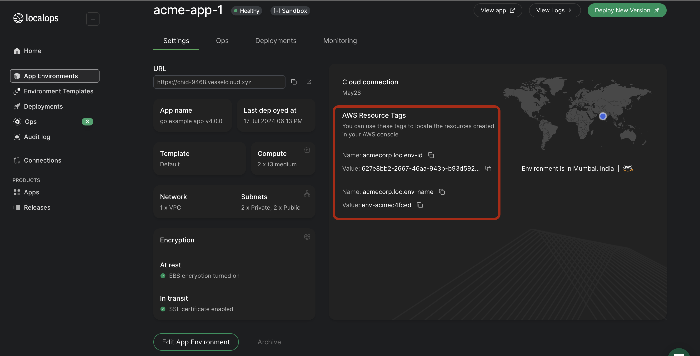

We tag all the resources created by LocalOps with specific keys and values that you can use to locate your resources
from your AWS console.

To view all the resources that belong to your environment

1. Find the tag keys and values added by LocalOps on your environment's settings page
   
2. Open the [AWS Resource Explorer](https://resource-explorer.console.aws.amazon.com/resource-explorer/home#/search)
   from your AWS console

3. Use a query such as tag.key:acmecorp.loc.env-id AND tag.value:627e8bb2-2667-46aa-943b-b93d5924fced to view all the
   resources associated with your application environment. Be sure to edit the tag key and values as needed.

4. You can further organize and manage these resources by creating AWS Resource Groups using these tags.
