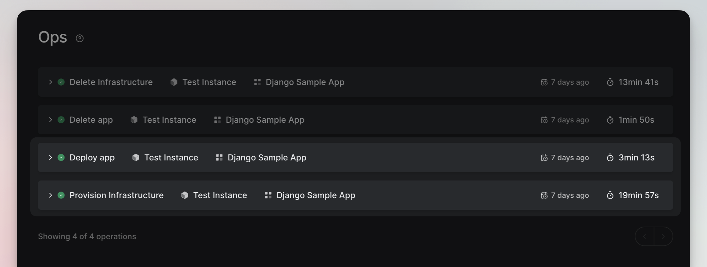

### Monitor an existing Environment

To monitor an environment, you need to make sure you have an environment that's up and running.

#### Steps to Monitor Your Environment

- Click on **Environments** from the navigation pane on the left side.
- Select the environment you want to monitor.
- Inside the Environment page, click on the **Monitoring** tab. Here, you'll find the Grafana URL, username, and
  password.
- Open the URL, then enter the username and password to log in to Grafana.
- Inside Grafana, you can see metrics like CPU utilization, RAM allocation, disk capacity, and various other stats for
  your environment.

And that's it! Now you can keep an eye on how your environment is performing.

### Monitoring New Environment Creation

Once you've triggered the creation of the Environment, operational logs will start appearing in the Ops view.

#### Ops Tab Details:

1. **Provision Infrastructure:** This log appears first, indicating the setup of the infrastructure.

2. **Deploy App:** Following infrastructure provisioning, you'll see this log, showing the deployment of your
   application.

Click the small arrow button next to each log to expand and view complete details.

### Monitoring a New Release to an Existing Environment

Whenever you make a new deployment to an existing environment, you can monitor the process through operational logs.

Once the deployment begins, navigate to the "Ops" tab to track its progress.

#### Ops Tab Details:

- **Deploy App:** Following infrastructure provisioning, you'll see this log, showing the deployment of your
  application.

Again, use the small arrow button to expand and view comprehensive logs.

**Note:** Upon completion, whether successful or unsuccessful, you can review detailed infrastructure logs under the Ops
tab.

