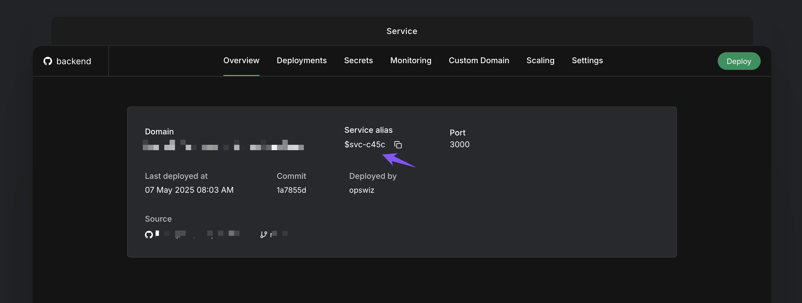
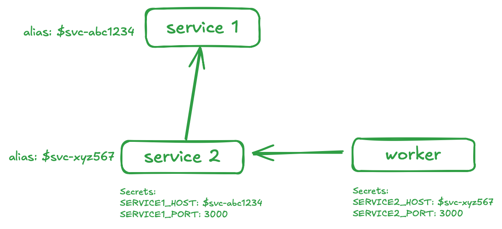

Your application may be composed of smaller micro services that depend on each other to fulfill business logic. This
guide will explain how to deploy your micro-services and make them accessible to each other within the environment.

You can login to LocalOps and create any number of environments and any number of services within an app environment.
Services can be of type - `Web/External service` or `Internal service` to expose themselves for either public usage
(`External`) or private usage within your environment (`Internal`).

### Using Service Alias as Hostname

When you [create a service](/environment/services/create), say `service1`, you will get an unique label called `Alias`.
You can find this in "Overview" tab of `service1`.

You can copy this alias string as-is from `service1` and use it in other dependent service, say `service2` as secret
variable to represent `service1` host name. Withing your code, you can access this as usual as an environment variable
to denote service1's host name.

Service `Alias` acts as an alias for a specific service's internal/private DNS hostname. It is unique within an
environment and will not change during the lifetime of a service. You can pass the alias string as a secret variable to
another service within the environment. At run time, when the secret is passed as environment variable to servicing
using the alias, the alias string will be replaced with actual internal host name of the service.
