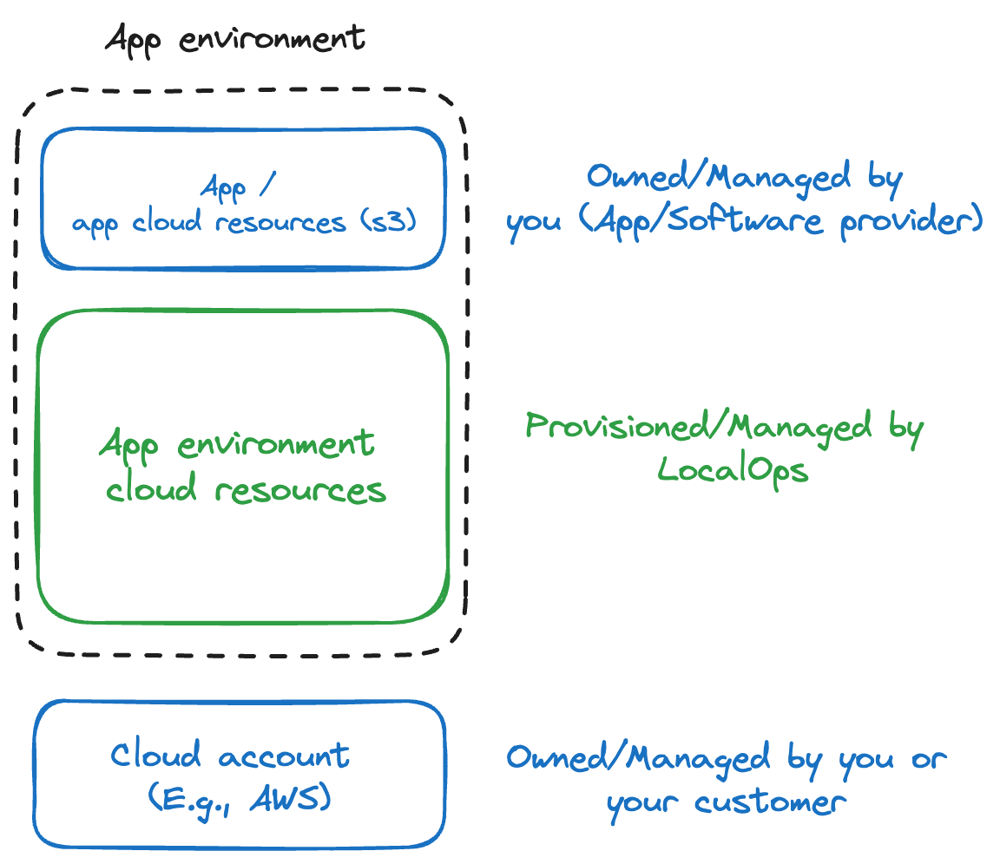

With app made by developers (you), cloud resources provisioned by LocalOps and cloud infrastructure as such provided by
cloud provider, it is essential to understand who manages what.

- You, the developer bring your app and are responsible to manage app-side issues.
- LocalOps provisions cloud resources programmatically and are responsuble to configure them to run your app.
- Cloud provider supplies the cloud resources and are responsible for availability of the underlying physical
  infrastructure.

