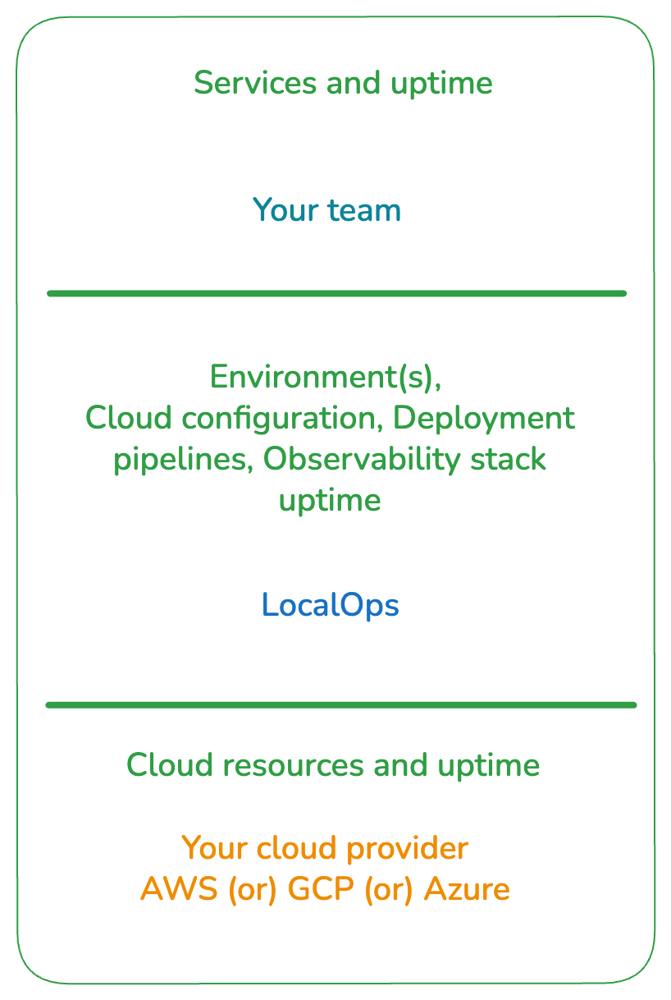

With services deployed by developers (you), cloud resources provisioned by LocalOps in the environment and cloud infrastructure as such provided by
cloud provider, it is essential to understand who manages what.

- You, the developer bring your services and are responsible to manage its app-side issues.
- LocalOps provisions cloud resources programmatically and is responsible to configure them to run your services.
- Your cloud provider supplies the cloud resources and are responsible for availability of the underlying physical server
  infrastructure.

